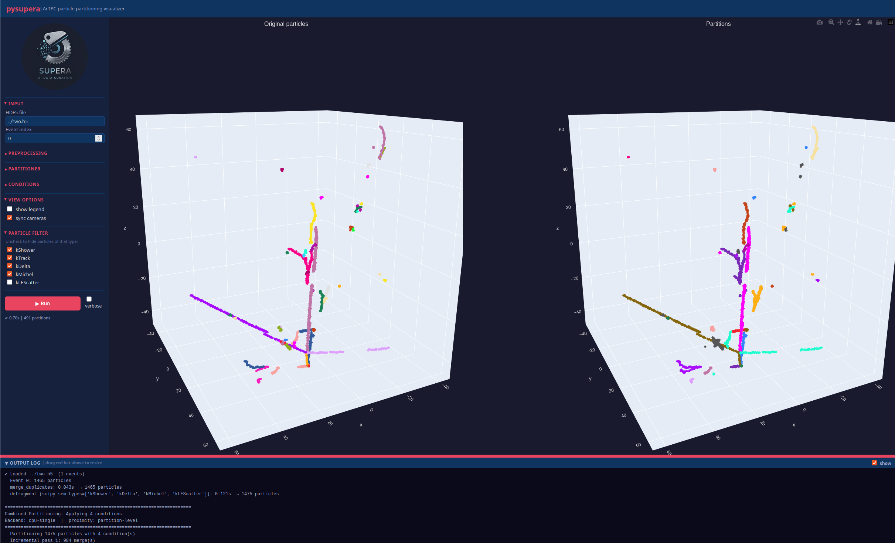

# pysupera

<p align="center">
  
</p>

[](https://github.com/drinkingkazu/pysupera/actions/workflows/tests.yml)

A Python library for grouping simulated LArTPC particles into physics partitions.
`pysupera` takes a list of reconstructed particles—each carrying a 3-D point cloud of detector hits—and merges spatially touching particles that satisfy configurable physical criteria into partition groups.

---

## Table of Contents

1. [Introduction](#introduction)
2. [Dependencies](#dependencies)
3. [Installation](#installation)
4. [Quick Start](#quick-start)
   - [Python API](#python-api)
   - [Interactive Event Viewer (`pysupera-app`)](#interactive-event-viewer-pysupera-app)
5. [Workflow](#workflow)
   - [Input: the `Particle` object](#input-the-particle-object)
   - [Step 0 — Configuration](#step-0--configuration)
   - [Step 1 — Preprocessing](#step-1--preprocessing)
   - [Step 2 — Applying Conditions](#step-2--applying-conditions)
   - [Step 3 — Generating Partitions](#step-3--generating-partitions)
   - [Step 4 — Output](#step-4--output)
6. [Output File Format](#output-file-format)
   - [Point ordering, and why it matters](#point-ordering-and-why-it-matters)
   - [Reading points](#reading-points)
   - [Which particles are stored](#which-particles-are-stored)
   - [Particle columns](#particle-columns)
   - [Interaction columns](#interaction-columns)
   - [ID conventions](#id-conventions)
   - [Expert and debugging output](#expert-and-debugging-output)
7. [Training Data (PyTorch)](#training-data-pytorch)
   - [Voxel merging](#voxel-merging)
   - [Low-energy scatters](#low-energy-scatters--include_le)
   - [Distributed training](#distributed-training)
   - [Profiling and W&B logging](#profiling-and-wb-logging)
8. [CLI Usage](#cli-usage)
9. [Compute Backends](#compute-backends)
10. [Algorithms](#algorithms)
   - [Partition-level Incremental Algorithm](#partition-level-incremental-algorithm)
   - [Proximity Check](#proximity-check)
   - [Condition Pipeline](#condition-pipeline)
11. [Conditions Reference](#conditions-reference)
12. [Diagnostics](#diagnostics)
13. [Assumptions](#assumptions)

---

## Introduction

In liquid-argon time-projection-chamber (LArTPC) simulations, each simulated particle (track, shower fragment, low-energy scatter, etc.) is associated with a set of 3-D space points.  Reconstruction algorithms typically produce one particle per connected sub-graph of the ionisation pattern, but physics processes—electromagnetic showers, low-energy scatters, secondary vertices—systematically fragment what is logically a single object into many reconstructed pieces.

`pysupera` reassembles those fragments into *partitions* by:

1. **Preprocessing** fragmented point clouds (optional).
2. **Selecting candidate pairs** using physical metadata (PDG code, semantic type, parent–child ancestry).
3. **Testing spatial proximity** between the merged point clouds of candidate partitions.
4. **Merging** touching candidates subject to condition-specific post-filters.

The result is a list of partitions, where each partition is a list of `Particle` objects that belong together physically.

---

## Dependencies

| Package | Required | Purpose |
|---|---|---|
| `numpy` | ✅ | Array operations throughout |
| `scipy` | ✅ | KDTree proximity checks (CPU backends), connected-components defragmentation |
| `h5py` | ✅ | HDF5 I/O (`EventStore`, `EventWriter`) |
| `hdf5plugin` | ✅ | Registers the Blosc/LZ4 HDF5 filters — needed to read JAXTPC inputs and to write `io.compression=lz4` |
| `hydra-core ≥ 1.3` | ✅ | Hierarchical configuration (CLI and programmatic) |
| `omegaconf ≥ 2.3` | ✅ | Config composition (dependency of Hydra) |
| `joblib` | optional | Parallel KDTree queries (`cpu-multi` backend) |
| `cupy` | optional | GPU pairwise distances (`bulk-gpu`, `gpu` defragmentation) |
| `cuml` (RAPIDS) | optional | GPU nearest-neighbour index (`gpu` backend) |
| `cudf`, `cugraph` (RAPIDS) | optional | Fully GPU defragmentation (`rapids` preprocessor) |
| `numba` | optional | CUDA kernel proximity checker (`numba` backend) |
| `torch` | optional | Training-data pipeline (`pysupera.torchdata`) |
| `psutil` | optional | Process and worker memory in `pysupera.profiling` (falls back to `/proc`) |
| `wandb` | optional | Weights & Biases logging of the training-data pipeline |

---

## Installation

```bash
# Clone or navigate to the pysupera repo root
cd /path/to/pysupera

# Editable install (recommended for development)
pip install -e .

# With GPU extras
pip install -e ".[gpu]"

# With Numba extras
pip install -e ".[numba]"

# With app (Dash interactive event viewer)
pip install -e ".[app]"

# With the PyTorch training-data pipeline
pip install -e ".[torch]"

# ... and Weights & Biases logging for it
pip install -e ".[torch,wandb]"

# With all dev tools
pip install -e ".[dev]"
```

---

## Quick Start

### Python API

```python
from pysupera import read_events
from pysupera.partitioner import ParticlePartitioner
from pysupera.conditions import PhotonDecay, TouchingEMShower, CombineLEScatters, AbsorbLEScatter

# Load particles for one event
with read_events("my_file.h5") as store:
    particles = list(store.iter_events())[0]

# Build the partitioner
partitioner = ParticlePartitioner(
    particles          = particles,
    distance_threshold = 5.0,   # mm (same units as point cloud coordinates)
    backend            = "cpu-single",
)

# Apply all conditions in one convergence loop
partitions = partitioner.partition_combined([
    PhotonDecay(),
    TouchingEMShower(),
    CombineLEScatters(),
    AbsorbLEScatter(),
])

print(f"{len(partitions)} partitions from {len(particles)} particles")
```

---

### Interactive Event Viewer (`pysupera-app`)

Install the app dependencies:

```bash
pip install -e ".[app]"
```

Launch the viewer:

```bash
pysupera-app                        # default: http://localhost:8050
pysupera-app --port 8080            # custom port
pysupera-app --host 0.0.0.0         # expose on the network
pysupera-app --debug                # enable Dash hot-reload
```

Then open the URL in a browser.  The sidebar lets you:

| Section | Controls |
|---|---|
| **INPUT** | HDF5 file path and event index |
| **INPUT FORMAT** | File format selector (`native` HDF5 or `edepsim_h5`); EDepSim-specific step/particle dataset keys and electron threshold |
| **PREPROCESSING** | Enable merge-duplicates and/or defragmentation; backend; semantic-type filter |
| **PARTITIONER** | Distance threshold, checker backend, `n_jobs` |
| **CONDITIONS** | Toggle each of the four conditions independently |
| **VIEW OPTIONS** | Show/hide legends; synchronise the two 3-D camera views; toggle **colour by sem type** (fast merged-trace rendering vs. per-particle instance colouring) |
| **PARTICLE FILTER** | Instantly show/hide particles by semantic type (no re-run needed); **Min points to display** hides small point clouds from the view without re-running the pipeline |

Hit **▶ Run** to execute the full pipeline and render two side-by-side 3-D point-cloud plots—original particles on the left, partitions on the right.

**Draw modes** (toggled via *colour by sem type* in VIEW OPTIONS):

| Mode | Left plot | Right plot | Speed |
|---|---|---|---|
| **by instance** (default) | One trace per particle, unique colour per ID; hover shows particle ID, PDG, parent | One trace per partition, unique colour per partition index | Slower for large events (many traces) |
| **by sem type** | One merged trace per semantic type with fixed colours | One merged trace per semantic type across all partitions | Fast — O(n\_sem\_types) traces regardless of event size |

The **PARTICLE FILTER** and **show legend** checkbox take effect immediately without re-running the pipeline.

<p align="center">
  
</p>

---

## Workflow

### Input: the `Particle` object

#### Required attributes

These attributes must always be supplied at construction time and are guaranteed to be set on every `Particle` instance.

| Attribute | Type | Description |
|---|---|---|
| `id` | `int` | Particle index within an event, assigned by the reader: `0 … n-1`, usable as a direct row index. **Not** the Geant4 track ID |
| `geant4_trackid` | `int` | Original Geant4 track ID, kept for provenance and for joining back to the input |
| `parent_id` | `int` | Direct parent's particle index; equals `id` for primary particles |
| `ancestor_id` | `int` | Particle index of the primary ancestor at the root of the shower/track genealogy |
| `pdg` | `int` | PDG Monte Carlo particle code |
| `parent_pdg` | `int` | PDG code of the direct parent particle |
| `process_type` | `InteractionType` | Physics process that created this particle; derived from the raw int stored in `_process_type` |
| `sem_type` | `SemanticType` | High-level semantic category derived automatically at construction (see below) |
| `point_cloud` | `ndarray (N, ≥3)` | 3-D hit positions; columns 0–2 are x, y, z |

#### Optional attributes

These attributes are not required at construction time.  Unset float32 scalars hold `FLOAT_UNSET` (= `np.float32('nan')`); all other unset attributes hold `None`.

| Attribute | Type | Default | Description |
|---|---|---|---|
| `start` | `ndarray (3,) float32` | `None` | Trajectory start position (vertex).  Also accessible as `p.vertex`. |
| `end` | `ndarray (3,) float32` | `None` | Trajectory end position. |
| `momentum_start` | `ndarray (3,) float32` | `None` | 3-momentum at the start vertex (MeV/c). |
| `momentum_end` | `ndarray (3,) float32` | `None` | 3-momentum at the trajectory end (MeV/c). |
| `kinetic_energy_start` | `float32` | `NaN` | Kinetic energy at the start vertex (MeV). |
| `kinetic_energy_end` | `float32` | `NaN` | Kinetic energy at the end of the trajectory (MeV). |
| `mass` | `float32` | `NaN` | Particle rest mass (MeV/c²). |
| `ancestor_pdg` | `int` | `None` | PDG code of the primary (root) ancestor particle. |
| `start_process_id` | `int` | `None` | Geant4/simulation process ID for this particle's creation. |
| `start_subprocess_id` | `int` | `None` | Geant4/simulation sub-process ID for this particle's creation. |
| `start_process_name` | `str` | `None` | Human-readable name of the creation process (e.g. `"eIoni"`). |
| `end_process_id` | `int` | `None` | Geant4/simulation process ID for this particle's termination. |
| `end_subprocess_id` | `int` | `None` | Geant4/simulation sub-process ID for this particle's termination. |
| `end_process_name` | `str` | `None` | Human-readable name of the termination process. |

**Checking whether an optional attribute is set:**

```python
if p.start is not None:              # array / int / str / list check
    print(p.start)

import numpy as np
if not np.isnan(p.kinetic_energy_start):  # float32 scalar check
    print(p.kinetic_energy_start)
```

**`vertex` property** — `p.vertex` is a read/write alias for `p.start`.

#### Semantic types

`sem_type` is derived automatically from `process_type`, `pdg`, `parent_pdg`, and `point_cloud` at construction time via `SetSemanticType`.  Particles with fewer than `min_pc_size` points may be reclassified as `kLEScatter`.

| Value | Meaning |
|---|---|
| `kShower` | EM shower fragment |
| `kTrack` | Charged track |
| `kDelta` | Delta-ray |
| `kMichel` | Michel electron |
| `kLEScatter` | Low-energy scatter product |
| `kUnknown` | Unclassified |

---

### Step 0 — Configuration

`pysupera` uses [Hydra](https://hydra.cc) for configuration.  The default config lives in `pysupera/conf/config.yaml`.

**Key top-level parameters:**

| Key | Default | Description |
|---|---|---|
| `distance_threshold` | `5.0` | Proximity distance *D* in point-cloud coordinate units |
| `verbose` | `true` | Print per-event progress |
| `report` | `true` | Print end-of-run summary statistics |
| `enable_diagnostics` | `false` | Record every merge decision for inspection |
| `check_particle_tree` | `false` | Validate parent–child consistency before partitioning |
| `checker` | `gpu` | Default compute backend (config group; override with `checker=cpu_single` etc.) |

**Particle preprocessing parameters** (`particle.*`):

| Key | Default | Description |
|---|---|---|
| `particle.min_pc_size` | `-1` | Min point-cloud size for semantic-type classification; `-1` disables (all sizes accepted) |
| `particle.merge_duplicates` | `true` | Collapse points sharing identical (x,y,z) coordinates before partitioning |
| `particle.defragment` | `true` | Split disconnected point-cloud fragments into new `kLEScatter` particles |
| `particle.preprocessor.name` | `scipy` | Defragmentation backend: `scipy`, `gpu`, or `rapids` |

**Programmatic loading** (notebooks, tests):

```python
from hydra import initialize, compose
from pysupera.config import build_conditions, build_checker, configure

with initialize(config_path="pysupera/conf", version_base=None):
    cfg = compose("config", overrides=[
        "checker=cpu_single",
        "distance_threshold=5.0",
        "io.input_path=my_file.h5",
        "io.output_path=out.h5",
    ])

configure(cfg)   # sets module-level defaults (min_pc_size, etc.)
```

---

### Step 1 — Preprocessing

Two optional preprocessing stages run before partitioning.

#### Merge Duplicates

Collapses points that share identical (x, y, z) voxel positions within each particle's point cloud.  Aggregation: `time = min`, `energy = sum`, `dEdx = max`.  Enable with:

```yaml
# config.yaml
particle:
  merge_duplicates: true
```

#### Defragmentation

A particle's point cloud may be *fragmented* — split into spatially disconnected clusters that should logically belong to the same particle.  The defragmenter runs a connected-components algorithm (eps-ball radius = `distance_threshold`) on each particle's point cloud independently, then detaches small disconnected fragments (size ≤ `min_pc_size`) as new `kLEScatter` particles.

Enable with:

```yaml
particle:
  defragment: true
  min_pc_size: -1       # default: -1 (disabled); set e.g. 5 to split small fragments
  preprocessor:
    name: scipy         # choices: scipy (default), gpu, rapids
```

| Backend | Requirement | Best for |
|---|---|---|
| `scipy` | `scipy` | General use; fast early-exit for non-fragmented particles |
| `gpu` | `cupy` | Large point clouds (> `min_pts_for_gpu` points) |
| `rapids` | `cupy` + `cudf` + `cugraph` | Fully GPU, no CPU round-trip |

All backends share the same fast-path early-exit checks (single point, two-point connected, bounding-box diameter ≤ eps) that skip the full CC algorithm for the majority of particles.

---

### Step 2 — Applying Conditions

A *condition* defines which pairs of particles (or partition representatives) are candidates for merging, and optionally post-filters the proximity-passing pairs.

Each condition implements:

```python
class PartitionConditionBase(ABC):
    def get_candidates(self, partitioner) -> List[Tuple[int, int]]:
        """Particle-level candidate pairs (legacy path)."""
    def post_filter(self, partitioner, touching_pairs) -> List[Tuple[int, int]]:
        """Optional filter after proximity check."""
    def get_rep_candidates(self, partitioner, rep_lookup) -> List[Tuple[int, int]]:
        """Partition-level candidate pairs (incremental path)."""
    def get_unconditional_merges(self, partitioner, rep_lookup) -> List[Tuple[int, int]]:
        """Topology-only merges, no proximity check needed."""
```

Conditions are applied in order.  The recommended order is:

```
PhotonDecay → TouchingEMShower → CombineLEScatters → AbsorbLEScatter
```

See [Conditions Reference](#conditions-reference) for details on each.

---

### Step 3 — Generating Partitions

```python
partitioner = ParticlePartitioner(
    particles          = particles,
    distance_threshold = 5.0,
    backend            = "cpu-single",   # see Compute Backends
    enable_diagnostics = False,
)

# Option A: one condition at a time
partitions = partitioner.partition(condition)

# Option B: all conditions in one converging pass
partitions = partitioner.partition_combined(conditions)
```

`partition` and `partition_combined` both return `List[List[Particle]]`.  Each inner list is one partition; singletons represent unmerged particles.

The default mode is **partition-level proximity** (`partition_level_proximity=True`): proximity is tested between the merged point clouds of whole partitions rather than individual particles, and the algorithm iterates until convergence (at most `max_passes=10` passes; typically 1–2).

---

### Step 4 — Output

```python
from pysupera import open_writer, read_events

# Write events (particles carry updated partition labels)
with open_writer("output.h5") as writer:
    writer.append_event(particles)

# Read events back
with read_events("output.h5") as store:
    for particles in store.iter_events():
        ...
```

---

## Output File Format

`run_pysupera` writes a single HDF5 file. This section describes format
**3.1.0**, recorded in the scalar dataset `format_version`. No HDF5 attributes
are used anywhere — everything is a dataset.

3.1.0 renamed columns for a consistent `<level>_` prefix, gave instances the
same two-range point layout as fragments, and added the true Geant4 parent.
Readers accept 3.0.0 files transparently.  3.0.0 replaced the three parallel
particle tables of 2.x with **one** table and
stores each point **once**. On a two-event file that is 6.4 MiB → 1.7 MiB.

### Layout

```
format_version   scalar str   "3.1.0"
n_events         scalar int64
events/offsets   (n_events+1,) int64   particle rows per event
points/offsets   (n_events+1,) int64   point rows per event
inter/offsets    (n_events+1,) int64   interaction rows per event
points/flat      (N, 6) float32        x, y, z, time, dE, dX
particles/<col>  (M,)
inter/<col>      (K,)
```

Everything is concatenated across events with CSR fenceposts: event *i*
occupies rows `offsets[i] : offsets[i+1]`.

### Point ordering, and why it matters

Points are ordered by

```
interaction  >  instance  >  is_LE  >  fragment  >  particle
```

Three consequences follow, and between them they replace everything 2.x needed
per-point group labels for:

1. **An instance's points are one contiguous block**, split into a non-LE part
   followed by an LE part. All three useful queries are single slices.
2. **A fragment's points are two runs** — its non-LE side and its LE side —
   because other fragments' non-LE points lie between them. Each side is
   always exactly *one* run, never more, so two ranges describe a fragment
   completely.
3. **LE-ness is positional**, so no per-point label is stored. A point is LE
   precisely when its index falls in its instance's `inst_pc_le_*` range.

The ordering is chosen for the query panoptic-segmentation training issues most
often — "the non-LE voxels of instance X" — which is a plain slice rather than
a mask over the instance's points.

### Reading points

```python
from pysupera.io_v3 import read_events_v3

with read_events_v3("out.h5") as store:
    v = store[0]                                   # column dict + points
    for r in np.flatnonzero(v.is_instance):
        non_le = v.points_of(r, "inst", le=False)  # one slice
        le     = v.points_of(r, "inst", le=True)   # one slice
        both   = v.points_of(r, "inst")            # one slice
        vtx    = v.interaction_of(r)
```

Equivalently, by hand:

```python
non_le = v.points[v["inst_pc_start"][r]    : v["inst_pc_end"][r]]
le     = v.points[v["inst_pc_le_start"][r] : v["inst_pc_le_end"][r]]

frag_nle    = v.points[v["frag_pc_start"][r]    : v["frag_pc_end"][r]]
frag_le     = v.points[v["frag_pc_le_start"][r] : v["frag_pc_le_end"][r]]
```

`-1` marks a side with no points. `points_of(r, "frag")` concatenates the two
runs; every other combination is a single slice.

### Which particles are stored

About 9% of them. A particle gets a row if it

1. **represents a fragment or instance that carries points**, or
2. **is an instance representative**, or
3. **lies on the ancestry of one**, including point-less links such as a π⁰
   between its two photons.

Merged shower members get no row — an instance is one object, and its
constituents are not individually addressable. **Every point is still stored**
regardless: a group's points are its members', whether or not those members
have rows, and no point is unreachable from some stored row.

### Particle columns

| Column | dtype | Meaning |
|---|---|---|
| `id` | int32 | this particle's index **within its event** |
| `geant4_trackid` | int32 | original Geant4 track ID (provenance) |
| `geant4_parent_trackid` | int32 | track ID of the **true** direct parent; `-1` for a primary |
| `geant4_parent_pdg` | int32 | PDG of that true parent; `-1` for a primary |
| `parent_id` | int32 | nearest **stored** ancestor; `== id` marks a primary |
| `ancestor_id` | int32 | the primary this particle descends from |
| `pdg`, `parent_pdg` | int32 | PDG codes |
| `interaction_id` | int32 | row index into this event's `inter/` slice |
| `interaction_type` | int32 | `InteractionType` enum |
| `sem_type` | int8 | this particle's own classification |
| `pc_start`, `pc_end` | int64 | this particle's own points |
| `frag_id` | int32 | representative's `id`; `== id` marks a fragment, `-1` none |
| `frag_sem_type` | int8 | the fragment's classification |
| `frag_pc_start/end` | int64 | the fragment's non-LE points |
| `frag_pc_le_start/end` | int64 | the fragment's LE points |
| `frag_merge_count` | int32 | Geant4 particles merged into the fragment |
| `frag_parent_id` | int32 | nearest ancestor fragment; `== id` if none |
| `inst_id` | int32 | representative's `id`; `== id` marks an instance |
| `inst_sem_type` | int8 | the instance's classification |
| `inst_pc_start/end` | int64 | the instance's non-LE points |
| `inst_pc_le_start/end` | int64 | the instance's LE points (adjacent: `inst_pc_end == inst_pc_le_start`) |
| `inst_merge_count` | int32 | Geant4 particles merged into the instance |
| `inst_parent_id` | int32 | nearest ancestor instance; `== id` if none |

A particle carries up to three classifications — its own, its fragment's and
its instance's — because merging reclassifies. Note that LE barely survives to
the group levels: `absorb_le_scatter` folds low-energy scatter into whatever
touches it, so ~31% of *points* are LE while almost no *instance* is.

### Interaction columns

| Column | dtype | Meaning |
|---|---|---|
| `interaction_id` | int32 | this table's own dense index — the value particles carry |
| `vertex_id` | int32 | the row this interaction had in the **input** vertex list |
| `x`, `y`, `z`, `time` | float32 | vertex position and time |
| `energy_sum`, `ke_sum` | float32 | vertex totals, copied from EDepSim |
| `reaction` | str | generator reaction label, copied from EDepSim |
| `part_start`, `part_end` | int32 | its particle rows |
| `pc_start`, `pc_end` | int64 | its points |

Interactions that no stored particle references are dropped and the survivors
renumbered. `interaction_id` is the index after renumbering, which is what a
particle's `interaction_id` refers to; `vertex_id` is the link back to the
input file, and is what survives the renumbering.

### Enumerating levels

A representative names itself, so each level is one comparison:

```python
fragments = v["frag_id"] == v["id"]
instances = v["inst_id"] == v["id"]
```

`-1` means the particle heads no group at that level. `inst_id == -1` is normal:
under `instance_output=traceable` (the default) an instance that nothing
visible depends on is dropped, so its members belong to no written instance.

### ID conventions

1. **`id` is pysupera's, not Geant4's.** It is `0 … N-1` over the event's
   *full* particle list, assigned before the output subset is chosen. Geant4
   track IDs are not guaranteed contiguous — an upstream stage may drop
   particles — and are kept separately in `geant4_trackid`. **Join back to
   the input on `geant4_trackid`, never on `id`.**

   **`id` is not a row index.** Only the particles worth keeping are written —
   about 17% of them — and rows are ordered by the point layout, not by `id`.
   So in a 2,902-row event the ids run to 21,254 and are not sorted. Build a
   map; do not index with an id:

   ```python
   row_of = {int(i): k for k, i in enumerate(v["id"])}
   k = row_of[some_id]          # not v["pdg"][some_id]
   ```

   The same applies to `parent_id`, `frag_id`, `inst_id`, `frag_parent_id`
   and `inst_parent_id`: all of them are ids, and all need the map.

2. **`geant4_trackid` is one-to-many.** Defragmentation splits a particle whose
   point cloud falls into disconnected pieces into several pysupera particles,
   and they all inherit the track they came from. `id` distinguishes them.

3. **Walking `parent_id` always terminates inside the file.** Because most
   particles have no row, `parent_id` points at the nearest *stored* ancestor,
   and a particle with no stored ancestor is marked a primary. `ancestor_id` is
   derived from that same redirected chain, so the walk and the stated ancestor
   agree.

**One asymmetry:** ids are per-event, but point ranges are stored *absolute*
into `points/flat`, so a whole-file reader slices with no arithmetic.
`EventStoreV3` rebases them on read, so inside an `EventView` everything shares
one origin and `v["pc_start"]` indexes `v.points` directly. Only raw h5py
readers see the absolute form.

### Point columns

```
0:x  1:y  2:z  3:time  4:dE  5:dX
```

Both merge stages operate within a single particle, so `dE` and `dX` both sum
over a particle-voxel and **dE/dX is column 4 / column 5**, exactly. Guard
against `dX == 0`: EDepSim writes zero-length steps, a few percent of voxels.

### Compression

Output is LZ4 by default (`io.compression`). The browser viewer uses h5wasm,
which supports **gzip only**:

```bash
pysupera-repack out.h5 out_vis.h5 --compression gzip --rechunk
```

`pysupera-repack` also resizes chunks to the final dataset lengths, which is
its other job — see the `repack` block in the config for why that needs a
second pass. Two further options:

```bash
# flip lz4 <-> gzip without having to remember which way round it is
pysupera-repack out.h5 flipped.h5 --compression auto

# compress every chunked dataset, not just those already compressed
pysupera-repack out.h5 small.h5 --compression gzip --scope all
```

`--compression auto` reads the file's dominant filter and swaps lz4 for gzip
or back; it errors rather than guess if the file is uncompressed. `--scope`
defaults to `source`, which leaves an uncompressed dataset uncompressed —
`all` overrides that. On a 100-event file, gzip is 65.4 MiB against LZ4's
89.4 MiB, so gzip is worth it for anything but the fastest reads.

### Expert and debugging output

Off by default, regenerable, and not intended for analysis.

#### The voxel mapping — `particle.voxelize.store_mapping=true`

Writes `<output>_voxmap.h5`: for every output voxel, which input deposits were
merged into it and with what energy. Two nested CSR levels:

```
particles/id, particles/vox_offsets   ->  a particle's voxels
voxels/input_offsets                  ->  a voxel's input points
flat/input_ids, flat/input_energies   ->  original point index + its energy
```

It carries one row per *input* deposit rather than per voxel, so it is
typically larger than the physics output itself. Nothing is computed when it is
off.

#### Seeing every instance — `instance_output=all`

Writes every instance the merger produced, including those that deposited
nothing and that nothing visible descends from. Use it to inspect the merger's
raw output; `traceable` is what analyses should read.

#### Per-merge records — `enable_diagnostics=true`

Records every merge decision in memory. Not written to the output file.


---

## Training Data (PyTorch)

`pysupera.torchdata` turns a 3.x file into batches for panoptic-segmentation
training. Install the extra first:

```bash
pip install -e ".[torch]"
```

```python
from pysupera.torchdata import make_dataloader

loader = make_dataloader("out.h5", batch_size=4, distributed=True,
                         num_workers=4)

for batch in loader:                      # batch_size counts *events*
    for ev in batch["events"]:
        x = ev["points"]                  # (V, 4) float32 — x, y, z, E
        s = ev["voxel_sem"]               # (V,) semantic label
        i = ev["voxel_instance"]          # (V,) instance id
        k = ev["voxel_interaction"]       # (V,) interaction id
```

Point clouds differ in length between events, so a batch stays a **list** of
events rather than a padded tensor; `batch_size` therefore means exactly a
number of events. `to_torch(ev, device)` converts one event's arrays to
tensors when the model needs them.

Alongside the three per-voxel label arrays, each event carries the object-level
tables `ev["instances"]` and `ev["interactions"]` — the same columns described
under [Particle columns](#particle-columns) and
[Interaction columns](#interaction-columns), restricted to instance rows. An
interaction's id is its row index, which is what `voxel_interaction` holds.

### Voxel merging

Model input is one row per voxel, but a voxel can receive energy from several
instances. Overlaps are resolved as follows:

- **Energy is summed** over every contribution, so no charge is lost.
- **Labels come from the winning contribution**, chosen by semantic priority
  `kTrack > kShower > kDelta > kMichel > kLEScatter`, then by earliest time
  within a class.

A track crossing a shower therefore keeps the voxel, and among two showers the
earlier one does. On a sample event ~10% of raw points share a cell with
another instance's.

### Low-energy scatters — `include_le`

LE deposits are roughly a third of all points. They are **excluded by
default**:

```python
loader = make_dataloader("out.h5", include_le=True)   # keep them
```

The flag governs the voxel data as a whole — input coordinates, energy, and all
three label arrays — so the model never sees a point that the labels do not
describe, and an excluded point contributes no energy either. On a sample
event, dropping LE removes 30% of the voxels and 13% of the energy.

A point counts as LE when its label is `kLEScatter`, which covers both an LE
deposit absorbed into some other instance (LE-ness is positional — see
[Point ordering](#point-ordering-and-why-it-matters)) and a point of an
instance that is itself LE. The instance and interaction labels of an absorbed
LE point remain those of its host, so it stays attributed to the shower or
track that absorbed it.

### Distributed training

`distributed=True` attaches a `DistributedSampler` so each rank sees a disjoint
shard of events. Call `loader.sampler.set_epoch(epoch)` at the top of every
epoch, or each rank replays the same order. Note that
`DistributedDataParallel` itself wraps the *model*; this module covers the
input side.

The HDF5 handle is opened lazily per worker, so `num_workers > 0` is safe.


### Profiling and W&B logging

`StreamMonitor` times the pipeline and samples memory around a loader:

```python
import wandb
from pysupera.torchdata import make_dataloader, StreamMonitor

wandb.init(project="lartpc-panoptic")

loader = make_dataloader("out.h5", batch_size=4, num_workers=4,
                         distributed=True)
mon = StreamMonitor(device="cuda", prefix="data")

for epoch in range(n_epochs):
    for batch in mon.iterate(loader, epoch=epoch):
        train_step(batch)               # already staged on the GPU

print(mon.finish())                     # also writes the W&B run summary
```

`iterate` stages each batch to *device*, forwards *epoch* to the
`DistributedSampler`, and logs per step. The metrics come in two kinds, and
mixing them up is the easy mistake.

**Main-process wall time.** These partition one iteration and sum to `step_s`:

| Metric | Meaning |
|---|---|
| `wait_s` | how long the loop **blocked** in `next(loader)` — workers not yet done, plus shipping the finished batch back and rebuilding it here |
| `stage_s` | host-to-device transfer |
| `consume_s` | the loop body — your training step, measured across the `yield` |
| `step_s` | `wait_s + stage_s + consume_s`, i.e. the real per-iteration wall time |
| `stall_fraction` | `wait_s / step_s` — **the headline number** |

**Worker-side cost.** Summed over the batch's events, measured wherever they
were produced:

| Metric | Meaning |
|---|---|
| `read_s` | h5py decompress + slice |
| `preprocess_s` | `build_event` (voxel merge, labels) plus any `transform` |
| `collate_s` | assembling the batch |
| `payload_mb` | array bytes the batch ships to the parent |
| `payload_mb_per_s` | `payload_mb / wait_s` — the rate batches actually arrive |

With `num_workers > 0` these run in other processes, concurrently with the
training step and with each other, so **their sum routinely exceeds `step_s`**.
They say what the work costs, not what it delays. Only `stall_fraction`
answers "is input the bottleneck".

Throughput and memory are logged alongside: `events_per_s`, `points_per_s`,
`n_points`, `batch_size`, and `cpu_rss_mb`, `cpu_rss_total_mb`,
`cpu_available_mb`, `gpu_alloc_mb`, `gpu_reserved_mb`, `gpu_peak_mb`,
`gpu_free_mb`, `gpu_total_mb`.

**`cpu_rss_total_mb` includes the worker processes**, which is where reading
and pre-processing actually allocate; the parent's own `cpu_rss_mb` says
nothing about them. On a 100-event file each worker added ~210 MiB over the
parent's 630 MiB, so eight workers cost ~4 GiB of host memory. Workers share
copy-on-write pages with the parent, so the total is an upper bound.

Enumerating children scans `/proc` and costs ~4.6 ms against ~0.2 ms for the
rest of the snapshot, so the handles are cached and re-enumerated only when
one dies or `profiling.CHILDREN_REFRESH_S` elapses — except that an *empty*
cache expires after `EMPTY_REFRESH_S`, since nothing in it could signal that a
worker pool has since appeared.

`summary()` adds totals and means, plus `wall_s` — measured by one clock
spanning the whole loop rather than summed — and `unaccounted_s`, the
difference between the two. That covers whatever falls outside a step — the
monitor's own overhead, and gaps between epochs such as tearing a worker pool
down — and should stay near zero; if it does not, something outside the
measured path is eating the clock. `first_wait_s` and `max_wait_s` isolate worker start-up, which
normally dominates every other wait.

Reading the output — two events per epoch, five epochs, a toy MLP, with one
warm-up epoch discarded:

```
                                   num_workers=0   nw=4,persist   nw=4,respawn
  wall                                   0.171 s        0.197 s        1.501 s
  wait_s      (blocked)        per step  13.87 ms       14.63 ms     120.18 ms
  stage_s     (host->device)   per step   0.41 ms        0.64 ms       1.13 ms
  consume_s   (training step)  per step   2.38 ms        3.41 ms       5.68 ms
  read_s      (worker)         per step   4.22 ms        9.46 ms      21.63 ms
  preprocess_s(worker)         per step   9.52 ms       12.86 ms      13.14 ms
  stall_fraction                           0.833          0.783          0.946
  first_wait_s                            9.8 ms        28.6 ms       230.1 ms
```

Three things worth reading off it:

- **`stall_fraction` is ~0.8 everywhere**, because the toy model is far too
  small to hide the input pipeline. That is the number to watch: with a real
  model `consume_s` grows and the fraction falls.
- **Workers do not help at this scale.** Two events per epoch is not enough
  work to amortise shipping batches between processes, so `num_workers=4` is
  marginally *slower* than loading in-process.
- **`persistent_workers=True` matters far more than the worker count.**
  Without it the pool is torn down and respawned every epoch, `first_wait_s`
  goes from 29 ms to 230 ms, and wall time is 8.8× worse. Pass it through
  `make_dataloader` to the DataLoader.

Beware one trap when reading your own numbers: the first steps of a process
pay for CUDA, cuBLAS and autograd initialisation, and that lands in
`consume_s`. Before the warm-up epoch above was added, `consume_s` read
116 ms against a true 2.4 ms. **Discard the first epoch when benchmarking.**

`StreamMonitor` warms the CUDA transfer path on construction, because the
first host-to-device copy in a process otherwise pays ~35 ms of lazy
initialisation against the ~1 ms a warm copy costs. Some first-step cost
remains while the caching allocator grows, so **discard step 1 when
benchmarking**.

The pieces are usable on their own: `pysupera.profiling.memory_snapshot()`
returns the memory dict, `WandbLogger` is the rank-aware no-op-safe sink, and
`stage_batch(batch, device)` returns `(batch, seconds)`.

Overhead is small enough to leave on: the per-event timing is two
`perf_counter` calls, and a memory snapshot is ~0.2 ms. Both can be turned off
anyway — `profile=False` on `make_dataloader`, `memory=False` on the monitor —
and `unaccounted_s` tells you whether it is worth it.


---

## CLI Usage

After installation the `run_pysupera` command is available:

```bash
# Basic run
run_pysupera io.input_path=/data/in.h5 io.output_path=/data/out.h5

# Use CPU multi-threaded backend, 8 threads
run_pysupera checker=cpu_multi checker.n_jobs=8

# Adjust distance threshold, disable verbose output
run_pysupera distance_threshold=3.0 verbose=false

# Enable defragmentation preprocessing
run_pysupera particle.defragment=true particle.min_pc_size=5

# Hydra parameter sweep (multiple runs)
run_pysupera --multirun \
    checker=gpu,bulk_gpu \
    distance_threshold=3.0,5.0,7.0
```

The working directory is not changed by Hydra, so relative paths in `io.*` resolve against the directory where the command is invoked.

---

## Compute Backends

Select the backend via the `backend` parameter of `ParticlePartitioner` or `checker=<name>` in the Hydra config.

| Backend name | Config key | Requirement | Description |
|---|---|---|---|
| `cpu-single` | `cpu_single` | `scipy` | Single-threaded KDTree |
| `cpu-multi` | `cpu_multi` | `scipy`, `joblib` | KDTree + joblib thread pool |
| `gpu` | `gpu` | `cuml` (RAPIDS) | RAPIDS NearestNeighbors (brute-force L2); **default** |
| `bulk-gpu` | `bulk_gpu` | `cupy` | CuPy chunked brute-force; accepts `chunk_size` |
| `numba` | `numba` | `numba`, CUDA | CUDA kernel with shared-memory tiling; accepts `block_size` |
| `cell-hash-cpu-single` | `cell_hash_cpu_single` | `scipy` | Cell-hash spatial index, single thread |
| `cell-hash-cpu-multi` | `cell_hash_cpu_multi` | `scipy`, `joblib` | Cell-hash + joblib |
| `cell-hash-gpu` | `cell_hash_gpu` | `cupy` | Cell-hash on CPU, distance kernels on GPU |

For the partition-level proximity mode (the hot path), all CPU backends override `batch_check_cloud_proximity` to build the parent KDTree **once** per candidate group rather than once per pair.

---

## Algorithms

### Partition-level Incremental Algorithm

The main algorithm (`_build_partitions_incremental`) maintains one representative `Particle` per partition.  A representative carries:
- All scalar attributes (PDG, semantic type, ancestry) of the particle that "won" each merge.
- A **lazily concatenated** point cloud (`_cloud_parts`) that is the union of all constituent particles' point clouds—concatenation is deferred until a proximity query actually needs the full array.

**Initialisation:**
- A `UnionFind` structure over all *n* particles.
- One representative per particle (shallow copy, `_cloud_parts = [original_cloud]`).
- `rep_lookup`: `particle_id → representative Particle`.
- `rep_members`: `id(rep) → [list of particle IDs]` (reverse map for O(|partition|) updates).

**Pass loop** (repeats until convergence, ≤ `max_passes`):

For each condition:

1. **Unconditional merges** (`get_unconditional_merges`): topology-driven pairs requiring no proximity check (e.g. photon → e⁺e⁻ from `PhotonDecay`).
2. **Candidate generation** (`get_rep_candidates`): directed `(child_rep_id, parent_rep_id)` pairs among current partition representatives.  Pairs are resolved to UF roots, deduplicated, then grouped by parent representative.
3. **Batch proximity check** (`batch_check_cloud_proximity`): for each parent group, the parent's cloud is materialized once (lazy concat), a single KDTree is built, and all children in the group are queried against it.
4. **Post-filter** (`post_filter`): condition-specific constraint (e.g. one merge per `kLEScatter`).
5. **Merge**: for each accepted pair, the child partition is absorbed into the parent.  The parent's `_cloud_parts` list is extended with the child's chunks (no allocation).  `rep_members` allows O(|child partition|) update of `rep_lookup`.

The loop terminates when a full pass over all conditions produces zero new merges.  At the end, surviving reps materialize their deferred clouds with a single `np.concatenate`.

**Complexity (per pass):**  
- Candidate building: O(n_reps) per condition.  
- Proximity checks: O(n_candidates × n_points_per_cloud / n_unique_parents) KDTree queries; each parent tree is built once.  
- `rep_lookup` update: O(|merged partition|) per merge (instead of O(n) with a full scan).

---

### Proximity Check

Two point clouds are considered *touching* if the minimum Euclidean distance between any point in one cloud and any point in the other is ≤ *D*.

The default implementation:
1. **Bounding-box rejection**: if the minimum possible distance between the two bounding boxes exceeds *D*, return `False` immediately (no KDTree needed).
2. **KDTree query**: build a `scipy.KDTree` on cloud B, query all points of cloud A with `distance_upper_bound = D`, return `True` if any distance ≤ *D*.

GPU backends (`GPUChecker`, `BulkGPUChecker`) override this with device-resident implementations and do not construct a CPU KDTree.

---

### Condition Pipeline

Each condition uses a three-stage pipeline:

```
get_candidates / get_rep_candidates
        ↓  (candidate pairs, O(n_class_A × n_class_B) in the worst case)
batch_check_proximity / batch_check_cloud_proximity
        ↓  (touching pairs only)
post_filter
        ↓  (merge pairs)
```

Only the touching subset proceeds to `post_filter`, and only the final `merge_pairs` are applied to the Union-Find structure.

---

## Conditions Reference

### `PhotonDecay`

**Purpose:** Merge the ±11 (e⁺/e⁻) decay products of a photon (PDG 22) into the photon's partition.

**Mechanism:** Purely topology-based (`get_unconditional_merges`).  A photon typically has an empty point cloud; its spatial extent is entirely represented by its children.  No proximity check is performed.

**Merge direction:** child (e⁺/e⁻) → parent (photon).  The photon representative survives and its `point_cloud` grows to include all child points.

**When to run:** Always first, before any proximity-based condition, so that the photon's cloud is populated before it participates in further proximity checks.

---

### `TouchingEMShower`

**Purpose:** Merge PDG-11/22 parent–child pairs that share a common ancestor and whose point clouds are spatially touching.

**Candidate filter:**
- Both particles have PDG code 11 or 22.
- Direct parent–child relationship.
- Same `ancestor_id`.

**Merge direction:** child → parent (directed by the parent–child tree).

**When to run:** After `PhotonDecay`, to consolidate EM shower fragments.

---

### `CombineLEScatters`

**Purpose:** Consolidate transitively connected `kLEScatter` particles into a single `kLEScatter` representative before absorption.

**Motivation:** `AbsorbLEScatter` makes pairwise decisions.  Without pre-consolidation, a chain *Shower A – LEScatter B – LEScatter C* may not correctly absorb B and C into A if A and C are not directly touching.

**Candidate filter:** All pairs of distinct `kLEScatter` partition representatives.

**Merge direction (tie-breaking, `_le_direction`):**
1. Larger point cloud becomes the parent.
2. On equal size: higher energy sum (column `PointFeature.energy`) wins.
3. On equal energy: stable arbitrary tie-break.

**When to run:** Before `AbsorbLEScatter`.

---

### `AbsorbLEScatter`

**Purpose:** Absorb each `kLEScatter` partition into at most one touching non-`kLEScatter` neighbour.

**Candidate filter:** All pairs between `kLEScatter` representatives and non-`kLEScatter` representatives.

**Post-filter:** One merge per `kLEScatter` — if multiple non-LE neighbours touch the same LE partition, only the first passing pair is kept.

**Merge direction:** `kLEScatter` representative → non-`kLEScatter` representative.

**When to run:** Last, after `CombineLEScatters`.

---

## Diagnostics

Enable with `enable_diagnostics=True`:

```python
partitioner = ParticlePartitioner(particles, 5.0, enable_diagnostics=True)
partitions  = partitioner.partition_combined(conditions)

# Why were particles 42 and 99 not merged?
print(partitioner.why_not_merged(42, 99))

# All recorded decisions involving particle 42
partitioner.print_all_decisions_for_particle(42)

# Aggregate summary
partitioner.print_diagnostics_summary()

# Export to JSON
partitioner.export_diagnostics("decisions.json")
```

Diagnostics add a per-pair record overhead.  With diagnostics disabled (the default), proximity checks use the fast `batch_check_proximity` path with no per-pair Python callback.

---

## Assumptions

1. **Coordinate units** — `distance_threshold` must be in the same units as the x, y, z columns of `point_cloud` (typically millimetres for LArTPC geometry).

2. **Parent–child completeness** — Each `parent_id` referenced by a particle should correspond to another particle in the same event list.  Enable `check_particle_tree: true` to validate this at runtime.  `children_map` and `ancestor_map` are built from the provided list; missing parents silently produce empty child lists.

3. **Single event at a time** — `ParticlePartitioner` is constructed fresh for each event.  The internal KDTree index (`checker`) is built during `__init__` and covers the particles as they exist at construction time.  Particles added by preprocessing (defragmenter splitting) must be passed to the constructor after preprocessing is complete.

4. **`_cloud_parts` attribute** — The incremental algorithm attaches `_cloud_parts` to each representative `Particle` object (a `list[ndarray]` of point-cloud chunks used for deferred concatenation).  This attribute is an internal implementation detail of the partitioner and is not serialised to HDF5.

5. **Point cloud columns** — Columns 0–2 are always treated as x, y, z.  Additional columns (time, energy deposit, dEdx, etc.) are carried through the pipeline unchanged but are not used by any proximity or condition logic except for the energy tie-break in `CombineLEScatters` (column index 4, `PointFeature.energy`).

6. **`kLEScatter` ordering** — `AbsorbLEScatter` takes the *first* touching non-LE neighbour in the order candidates are iterated, which depends on the ordering of `rep_lookup`.  This is deterministic within a single run but may vary across Python versions or dict iteration orders in unusual environments.

7. **Convergence** — The pass loop terminates when no new merges occur in a complete pass.  The loop is capped at `max_passes=10` as a safety guard.  In practice, 1–2 passes are sufficient for typical LArTPC events.

8. **GPU availability** — GPU backends (`gpu`, `bulk-gpu`, `numba`, `cell-hash-gpu`) raise an `ImportError` at construction time if the required libraries are not installed.  The CPU backends (`cpu-single`, `cpu-multi`, `cell-hash-cpu-single`, `cell-hash-cpu-multi`) require only `scipy` and optionally `joblib`.
