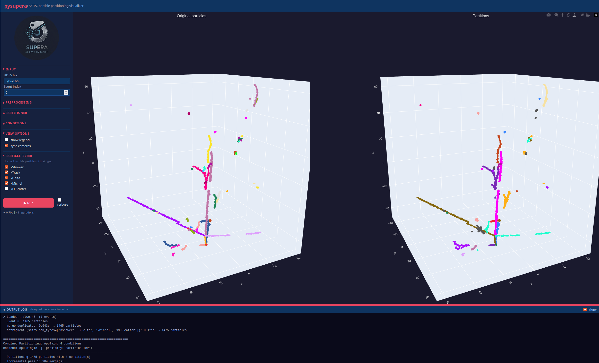

# pysupera

<p align="center">
  
</p>

[](https://github.com/drinkingkazu/pysupera/actions/workflows/tests.yml)

A Python library for grouping simulated LArTPC particles into physics partitions.
`pysupera` takes a list of reconstructed particles—each carrying a 3-D point cloud of detector hits—and merges spatially touching particles that satisfy configurable physical criteria into partition groups.

---

## Table of Contents

1. [Introduction](#introduction)
2. [Dependencies](#dependencies)
3. [Installation](#installation)
4. [Quick Start](#quick-start)
   - [Python API](#python-api)
   - [Interactive Event Viewer (`pysupera-app`)](#interactive-event-viewer-pysupera-app)
   - [Browser viewers](#browser-viewers)
5. [Workflow](#workflow)
   - [Input: the `Particle` object](#input-the-particle-object)
   - [Choosing a reader](#choosing-a-reader)
   - [Step 0 — Configuration](#step-0--configuration)
   - [Step 1 — Preprocessing](#step-1--preprocessing)
   - [Step 2 — Applying Conditions](#step-2--applying-conditions)
   - [Step 3 — Generating Partitions](#step-3--generating-partitions)
   - [Step 4 — Output](#step-4--output)
6. [Output File Format](#output-file-format)
   - [Point ordering, and why it matters](#point-ordering-and-why-it-matters)
   - [Reading points](#reading-points)
   - [Which particles are stored](#which-particles-are-stored)
   - [Particle columns](#particle-columns)
   - [Interaction columns](#interaction-columns)
   - [ID conventions](#id-conventions)
   - [Wire and pixel readout](#wire-and-pixel-readout)
   - [Wire deposits and pixel hits](#wire-deposits-and-pixel-hits)
   - [What the output stores (JAXTPC input)](#what-the-output-stores-jaxtpc-input)
   - [Hit provenance (JAXTPC mode)](#hit-provenance-jaxtpc-mode)
     - [Seeing it](#seeing-it)
   - [Expert and debugging output](#expert-and-debugging-output)
7. [Training Data (PyTorch)](#training-data-pytorch)
   - [Voxel merging](#voxel-merging)
   - [Low-energy scatters](#low-energy-scatters--include_le)
   - [Distributed training](#distributed-training)
   - [Profiling and W&B logging](#profiling-and-wb-logging)
8. [CLI Usage](#cli-usage)
9. [Compute Backends](#compute-backends)
   - [Pipeline performance](#pipeline-performance)
10. [Algorithms](#algorithms)
   - [Voxelization](#voxelization-1)
   - [Defragmentation](#defragmentation-1)
   - [Partition-level Incremental Algorithm](#partition-level-incremental-algorithm)
   - [Proximity Check](#proximity-check)
   - [Condition Pipeline](#condition-pipeline)
11. [Conditions Reference](#conditions-reference)
12. [Diagnostics](#diagnostics)
13. [Assumptions](#assumptions)

---

## Introduction

In liquid-argon time-projection-chamber (LArTPC) simulations, each simulated particle (track, shower fragment, low-energy scatter, etc.) is associated with a set of 3-D space points.  Reconstruction algorithms typically produce one particle per connected sub-graph of the ionisation pattern, but physics processes—electromagnetic showers, low-energy scatters, secondary vertices—systematically fragment what is logically a single object into many reconstructed pieces.

`pysupera` reassembles those fragments into *partitions* by:

1. **Preprocessing** fragmented point clouds (optional).
2. **Selecting candidate pairs** using physical metadata (PDG code, semantic type, parent–child ancestry).
3. **Testing spatial proximity** between the merged point clouds of candidate partitions.
4. **Merging** touching candidates subject to condition-specific post-filters.

The result is a list of partitions, where each partition is a list of `Particle` objects that belong together physically.

---

## Dependencies

| Package | Required | Purpose |
|---|---|---|
| `numpy` | ✅ | Array operations throughout |
| `scipy` | ✅ | KDTree proximity checks (CPU backends), connected-components defragmentation |
| `h5py` | ✅ | HDF5 I/O (`EventStore`, `EventWriter`) |
| `hdf5plugin` | ✅ | Registers the Blosc/LZ4 HDF5 filters — needed to read JAXTPC inputs and to write `io.compression=lz4` |
| `hydra-core ≥ 1.3` | ✅ | Hierarchical configuration (CLI and programmatic) |
| `omegaconf ≥ 2.3` | ✅ | Config composition (dependency of Hydra) |
| `joblib` | optional | Parallel KDTree queries (`cpu-multi` backend) |
| `cupy` | optional | GPU pairwise distances (`bulk-gpu`, `gpu` defragmentation) |
| `cuml` (RAPIDS) | optional | GPU nearest-neighbour index (`gpu` backend) |
| `cudf`, `cugraph` (RAPIDS) | optional | Fully GPU defragmentation (`rapids` preprocessor) |
| `numba` | optional | CUDA kernel proximity checker (`numba` backend) |
| `torch` | optional | Training-data pipeline (`pysupera.torchdata`) |
| `psutil` | optional | Process and worker memory in `pysupera.profiling` (falls back to `/proc`) |
| `wandb` | optional | Weights & Biases logging of the training-data pipeline |

---

## Installation

```bash
# Clone or navigate to the pysupera repo root
cd /path/to/pysupera

# Editable install (recommended for development)
pip install -e .

# With GPU extras
pip install -e ".[gpu]"

# With Numba extras
pip install -e ".[numba]"

# With app (Dash interactive event viewer)
pip install -e ".[app]"

# With the PyTorch training-data pipeline
pip install -e ".[torch]"

# ... and Weights & Biases logging for it
pip install -e ".[torch,wandb]"

# With all dev tools
pip install -e ".[dev]"
```

---

## Quick Start

### Python API

```python
from pysupera import read_events
from pysupera.partitioner import ParticlePartitioner
from pysupera.conditions import PhotonDecay, TouchingEMShower, CombineLEScatters, AbsorbLEScatter

# Load particles for one event
with read_events("my_file.h5") as store:
    particles = list(store.iter_events())[0]

# Build the partitioner
partitioner = ParticlePartitioner(
    particles          = particles,
    distance_threshold = 5.0,   # mm (same units as point cloud coordinates)
    backend            = "cpu-single",
)

# Apply all conditions in one convergence loop
partitions = partitioner.partition_combined([
    PhotonDecay(),
    TouchingEMShower(),
    CombineLEScatters(),
    AbsorbLEScatter(),
])

print(f"{len(partitions)} partitions from {len(particles)} particles")
```

---

### Interactive Event Viewer (`pysupera-app`)

Install the app dependencies:

```bash
pip install -e ".[app]"
```

Launch the viewer:

```bash
pysupera-app                        # default: http://localhost:8050
pysupera-app --port 8080            # custom port
pysupera-app --host 0.0.0.0         # expose on the network
pysupera-app --debug                # enable Dash hot-reload
```

Then open the URL in a browser.  The sidebar lets you:

| Section | Controls |
|---|---|
| **INPUT** | HDF5 file path and event index |
| **INPUT FORMAT** | File format selector (`native` HDF5 or `edepsim_h5`); EDepSim-specific step/particle dataset keys and electron threshold |
| **PREPROCESSING** | Enable merge-duplicates and/or defragmentation; backend; semantic-type filter |
| **PARTITIONER** | Distance threshold, checker backend, `n_jobs` |
| **CONDITIONS** | Toggle each of the four conditions independently |
| **VIEW OPTIONS** | Show/hide legends; synchronise the two 3-D camera views; toggle **colour by sem type** (fast merged-trace rendering vs. per-particle instance colouring) |
| **PARTICLE FILTER** | Instantly show/hide particles by semantic type (no re-run needed); **Min points to display** hides small point clouds from the view without re-running the pipeline |

Hit **▶ Run** to execute the full pipeline and render two side-by-side 3-D point-cloud plots—original particles on the left, partitions on the right.

**Draw modes** (toggled via *colour by sem type* in VIEW OPTIONS):

| Mode | Left plot | Right plot | Speed |
|---|---|---|---|
| **by instance** (default) | One trace per particle, unique colour per ID; hover shows particle ID, PDG, parent | One trace per partition, unique colour per partition index | Slower for large events (many traces) |
| **by sem type** | One merged trace per semantic type with fixed colours | One merged trace per semantic type across all partitions | Fast — O(n\_sem\_types) traces regardless of event size |

The **PARTICLE FILTER** and **show legend** checkbox take effect immediately without re-running the pipeline.

<p align="center">
  
</p>

---

### Browser viewers

Three standalone HTML files, one per run mode, that read HDF5 directly in the
browser — no server, no install. Open the file and pick your inputs, or pass
them as URL parameters when the files are served over HTTP.

| run mode | viewer | inputs | URL parameters |
|---|---|---|---|
| EDepSim only | `vis_force.html` | the output | `?file=out_gz.h5` |
| JAXTPC wire | `vis_hits.html` | the output **and** a hits subset | `?out=out_gz.h5&hits=hits_small.h5` |
| JAXTPC pixel | `vis_drift.html` | the output **and** a hits subset | `?out=out_gz.h5&hits=hits_small.h5` |

The viewers read HDF5 through **h5wasm, which decodes gzip only**, so both
inputs have to be prepared first:

```bash
pysupera-repack out.h5 out_gz.h5 -c gzip                  # the pysupera output
pysupera-hits-subset sim_hits_0000.h5 hits_small.h5 -n 3  # JAXTPC modes only
```

`-c gzip` is not optional: without it each dataset keeps its existing filter
(bitshuffle+LZ4 for `points/flat`), which the browser cannot read.
`pysupera-hits-subset` copies the first *n* events of a JAXTPC hits file as
gzip and decodes every CSR entry into one row per hit — `hit_tick`,
`hit_charge` and either `hit_wire` (wire) or `hit_py`/`hit_pz` (pixel) — in
the same order as the file's CSR, so row *k* lines up with entry *k* of the
output's `hit_labels`. It finds planes structurally and copies `config`, so
it needs no flag to tell wire from pixel. `--centres-only` keeps just the
group centres, for a much smaller file when the per-hit rows are not needed.

#### `vis_force.html` — EDepSim only

One 3-D cloud of `points/flat`. Colour by energy, time, interaction id,
ancestor track id, fragment id, instance id or PDG code, with a selectable
colormap and optional log scale. LE and non-LE points toggle independently,
energy and time thresholds slide, and a bounding box clips the view. An
animation plays the event by time, and an interaction panel and a
force-directed instance-genealogy graph open alongside.

Shortcuts: `c` centre · `a` axes · `s` screenshot · `space` play/pause ·
`r` reset animation · `o` auto-rotate · `i` interaction panel · `g` graph ·
`d` debug log · `?` help.

#### `vis_hits.html` — JAXTPC wire

Left: the 3-D cloud of `points/flat` (3 mm truth voxels). Right: one 2-D
image per `hit_labels/volume{V}/plane{P}` group, stacked in rows — six for a
two-volume, three-plane detector — each wire against drift tick, one pixel per
hit. The same colour means the same object everywhere.

**Hover anywhere and the object under the cursor lights up in every view**:
a voxel highlights its hits on all six planes, and a hit highlights its voxels
in 3-D and its hits on the other planes. The link is the label itself — the
voxel's range in `points/flat` and the hit's `instance_id` / `fragment_id` in
`hit_labels` — so the views cannot disagree.

| control | |
|---|---|
| **highlight** | instance, fragment or interaction — what "the object under the cursor" means |
| **others** | opacity of everything not selected |
| **hide LE** | drops low-energy voxels and hits from every view, so the picker cannot select them |
| **point info** | position, t, dE, dX, θ, φ, \|p\| and labels for a voxel; volume, plane, wire, tick, charge and labels for a hit |
| **c** | fit the 3-D view |

Plane headers give the hit count, wire and tick range and how many hits are
highlighted. A red banner appears instead of a wrong picture for a pixel file,
an output without `hit_labels`, a subset without per-hit rows, or labels and
hits of different lengths.

#### `vis_drift.html` — JAXTPC pixel

Two 3-D panes: the **truth** — `points/flat`, at the true x — on the left, and
the **hits** — every hit of the subset, at the x inferred from its drift tick
assuming t0 at the beam time — on the right. Hit positions come from the
pixel geometry the run records in the output's `pixel_geometry` attribute:

```
x = x_anode − drift_direction · (tick − reference_tick) · mm_per_tick
y = y_min + (py + ½) · pitch        z = z_min + (pz + ½) · pitch
```

so a non-zero t0 shows as a shift along x between the panes. Cameras are
synchronised (rotate, zoom or pan with the arrow keys in either pane) and both
are framed on the union of the two clouds, so a displacement reads as one.

**Hover a point in either pane and its whole object lights up in both**,
everything else fading to an adjustable opacity. The `highlight` selector
chooses what "its object" means — instance, fragment or interaction —
independently of the colour.

| colour by | encoding |
|---|---|
| energy | dE [MeV] on the left, hit charge [ADC] on the right, each with its own ramp; optional log |
| semantic type | the six categorical slots in fixed order; LE points as LE scatter |
| fragment / instance / interaction id | a stable hash, the same in both panes |
| particle type (PDG) | the instance's PDG, fixed hues for the six commonest species |

The semantic-type strip filters classes in and out of both panes, and a
**show ≥** slider per pane hides the faintest points by percentile, showing
the absolute value it lands on. By default only on-sensor hits are drawn —
the ones the model sees; **off-sensor hits** adds the rest, which carry no
label (`-1`) and are drawn grey.

#### What the energy column holds

In `points/flat` it is always true dE in MeV: with JAXTPC input the stored
points are the true deposits behind the hits, whatever the partitioning ran
on. Measured charge stays in the JAXTPC hits file, which is where
`vis_drift.html` reads it from. The root attributes `point_source`,
`hit_energy`, `hit_x_from` and `readout_type` record what the *partitioning*
ran on — for a pixel run, the hits' charge at nominal x — not what
`points/flat` holds.

---

## Workflow

### Input: the `Particle` object

#### Required attributes

These attributes must always be supplied at construction time and are guaranteed to be set on every `Particle` instance.

| Attribute | Type | Description |
|---|---|---|
| `id` | `int` | Particle index within an event, assigned by the reader: `0 … n-1`, usable as a direct row index. **Not** the Geant4 track ID |
| `geant4_trackid` | `int` | Original Geant4 track ID, kept for provenance and for joining back to the input |
| `parent_id` | `int` | Direct parent's particle index; equals `id` for primary particles |
| `ancestor_id` | `int` | Particle index of the primary ancestor at the root of the shower/track genealogy |
| `pdg` | `int` | PDG Monte Carlo particle code |
| `parent_pdg` | `int` | PDG code of the direct parent particle |
| `process_type` | `InteractionType` | Physics process that created this particle; derived from the raw int stored in `_process_type` |
| `sem_type` | `SemanticType` | High-level semantic category derived automatically at construction (see below) |
| `point_cloud` | `ndarray (N, ≥3)` | 3-D hit positions; columns 0–2 are x, y, z |

#### Optional attributes

These attributes are not required at construction time.  Unset float32 scalars hold `FLOAT_UNSET` (= `np.float32('nan')`); all other unset attributes hold `None`.

| Attribute | Type | Default | Description |
|---|---|---|---|
| `start` | `ndarray (3,) float32` | `None` | Trajectory start position (vertex).  Also accessible as `p.vertex`. |
| `end` | `ndarray (3,) float32` | `None` | Trajectory end position. |
| `momentum_start` | `ndarray (3,) float32` | `None` | 3-momentum at the start vertex (MeV/c). |
| `momentum_end` | `ndarray (3,) float32` | `None` | 3-momentum at the trajectory end (MeV/c). |
| `kinetic_energy_start` | `float32` | `NaN` | Kinetic energy at the start vertex (MeV). |
| `kinetic_energy_end` | `float32` | `NaN` | Kinetic energy at the end of the trajectory (MeV). |
| `mass` | `float32` | `NaN` | Particle rest mass (MeV/c²). |
| `ancestor_pdg` | `int` | `None` | PDG code of the primary (root) ancestor particle. |
| `start_process_id` | `int` | `None` | Geant4/simulation process ID for this particle's creation. |
| `start_subprocess_id` | `int` | `None` | Geant4/simulation sub-process ID for this particle's creation. |
| `start_process_name` | `str` | `None` | Human-readable name of the creation process (e.g. `"eIoni"`). |
| `end_process_id` | `int` | `None` | Geant4/simulation process ID for this particle's termination. |
| `end_subprocess_id` | `int` | `None` | Geant4/simulation sub-process ID for this particle's termination. |
| `end_process_name` | `str` | `None` | Human-readable name of the termination process. |

**Checking whether an optional attribute is set:**

```python
if p.start is not None:              # array / int / str / list check
    print(p.start)

import numpy as np
if not np.isnan(p.kinetic_energy_start):  # float32 scalar check
    print(p.kinetic_energy_start)
```

**`vertex` property** — `p.vertex` is a read/write alias for `p.start`.

#### Semantic types

`sem_type` is derived automatically from `process_type`, `pdg`, `parent_pdg`, and `point_cloud` at construction time via `SetSemanticType`.  Particles with fewer than `min_pc_size` points may be reclassified as `kLEScatter`.

| Value | Meaning |
|---|---|
| `kShower` | EM shower fragment |
| `kTrack` | Charged track |
| `kDelta` | Delta-ray |
| `kMichel` | Michel electron |
| `kLEScatter` | Low-energy scatter product |
| `kUnknown` | Unclassified |

---

### Choosing a reader

Which kind of input a run reads is a Hydra config group, one file per
arrangement, selected with `reader=`:

| `reader=` | input | point cloud |
|---|---|---|
| `edepsim_h5` (default) | EDepSim only | every Geant4 energy-deposit step |
| `jaxtpc_wire` | EDepSim + JAXTPC wire batch | deposits the readout detected |
| `jaxtpc_pixel` | EDepSim + JAXTPC pixel batch (+ sensor file) | the detected image: hits on sensor pixels, the energy the sensors recorded |

A pixel batch is only read as its hits. For either readout the output holds
the true deposits behind the hits in `points/flat` and a label per hit in
`hit_labels/` — see [What the output stores](#what-the-output-stores-jaxtpc-input).

`reader=jaxtpc_pixel` also brings the settings hits need outside the reader
group — `particle.min_pc_size`, `distance_threshold`,
`check_group_ownership` — from
`conf/readout/jaxtpc_pixel.yaml`, loaded after `config.yaml`'s own values; a
command-line flag still wins. `reader.point_source=deposits` is refused.

The two JAXTPC configs inherit `edepsim_h5`, so the dataset keys are written
once, and each adds only what its own arrangement needs — `jaxtpc_wire` has
no `point_source` or pixel-geometry options at all, because a wire plane has
no 3-D image to convert.

Particle metadata (PDG, track IDs, interaction type) always comes from the
EDepSim file at `io.input_path`, whichever reader is selected. The JAXTPC
configs mark their two input paths as required, so selecting one without
them stops the run rather than quietly falling back to reading EDepSim:

```
This reader config is for JAXTPC input and needs reader.jaxtpc_seg_path and
reader.jaxtpc_inst_path.  Pass them on the command line, e.g.
    reader.jaxtpc_seg_path=batch/step/run/name_step_0000_00.h5
    reader.jaxtpc_inst_path=batch/hits/run/name_hits_0000_00.h5
Use reader=edepsim_h5 to read the EDepSim steps directly instead.
```

The full set of config groups is `io`, `reader`, `checker` and `conditions`;
see [Step 0](#step-0--configuration).

### Step 0 — Configuration

`pysupera` uses [Hydra](https://hydra.cc) for configuration.  The default config lives in `pysupera/conf/config.yaml`.

**Key top-level parameters:**

| Key | Default | Description |
|---|---|---|
| `distance_threshold` | `5.2` | Proximity distance *D* in point-cloud coordinate units (6.2 with `reader=jaxtpc_pixel`) |
| `verbose` | `false` | Print per-event detail |
| `report` | `true` | Print end-of-run summary statistics |
| `enable_diagnostics` | `false` | Record every merge decision for inspection |
| `check_particle_tree` | `false` | Validate parent–child consistency before partitioning |
| `checker` | `cpu_single` | Compute backend (config group; override with `checker=cpu_multi` etc.) |

**Particle preprocessing parameters** (`particle.*`):

| Key | Default | Description |
|---|---|---|
| `particle.min_pc_size` | `5` | Occupied voxels below which a particle is `kLEScatter` (63 with `reader=jaxtpc_pixel`); `-1` disables |
| `particle.merge_duplicates` | `true` | Collapse points sharing identical (x,y,z) coordinates; subsumed by the voxelizer when it is on |
| `particle.voxelize.enabled` | `true` | Merge each particle's points on a `voxel_size` grid (3 mm, fixed `origin`) before defragmentation |
| `particle.voxelize.store` | `voxels` | What `points/flat` holds: the voxels, or (`points`) every input point |
| `particle.defragment` | `true` | Split disconnected point-cloud fragments into new `kLEScatter` particles |
| `particle.preprocessor.name` | `scipy` | Defragmentation backend: `scipy`, `gpu`, or `rapids` |

**Programmatic loading** (notebooks, tests):

```python
from hydra import initialize, compose
from pysupera.config import build_conditions, build_checker, configure

with initialize(config_path="pysupera/conf", version_base=None):
    cfg = compose("config", overrides=[
        "checker=cpu_single",
        "distance_threshold=5.0",
        "io.input_path=my_file.h5",
        "io.output_path=out.h5",
    ])

configure(cfg)   # sets module-level defaults (min_pc_size, etc.)
```

---

### Step 1 — Preprocessing

Three stages run before partitioning, in this order, each within one
particle at a time: merge duplicates, voxelization, defragmentation.

#### Merge Duplicates

Collapses points that share identical (x, y, z) positions within each particle's point cloud.  Aggregation: `time = min`, `dE = sum`, `dX = sum`.  Skipped when the voxelizer runs with `voxelize.merge_duplicates: true` (the default), since voxelizing merges them anyway.  Enable with:

```yaml
# config.yaml
particle:
  merge_duplicates: true
```

#### Voxelization

Bins every particle's points on the `particle.voxelize` grid (3 mm cells from
a fixed `origin`) and merges the points sharing a cell: cell centre,
`time = min`, `dE = sum`, `dX = sum`. The voxels are what proximity,
defragmentation and the extent classification see. See
[Voxelization](#voxelization-1) under Algorithms for how it is computed.

#### Defragmentation

A particle's point cloud may be *fragmented* — split into spatially disconnected clusters that should logically belong to the same particle.  The defragmenter runs a connected-components algorithm (eps-ball radius = `distance_threshold`) on each particle's point cloud independently, then detaches small disconnected fragments (size ≤ `min_pc_size`) as new `kLEScatter` particles.  By default only `kShower`, `kDelta`, `kMichel` and `kLEScatter` particles are examined (`preprocessor.sem_types`); tracks are left whole.

Enable with:

```yaml
particle:
  defragment: true
  min_pc_size: 5        # voxels; fragments this small become kLEScatter
  preprocessor:
    name: scipy         # choices: scipy (default), gpu, rapids
```

| Backend | Requirement | Best for |
|---|---|---|
| `scipy` | `scipy` | General use; fast early-exit for non-fragmented particles |
| `gpu` | `cupy` | Large point clouds (> `min_pts_for_gpu` points) |
| `rapids` | `cupy` + `cudf` + `cugraph` | Fully GPU, no CPU round-trip |

All backends share the same fast-path early-exit checks (single point, two-point connected, bounding-box diameter ≤ eps) that skip the full CC algorithm for the majority of particles.  The `scipy` backend then clusters all remaining particles of an event in one pass — see [Defragmentation](#defragmentation-1) under Algorithms.

---

### Step 2 — Applying Conditions

A *condition* defines which pairs of particles (or partition representatives) are candidates for merging, and optionally post-filters the proximity-passing pairs.

Each condition implements:

```python
class PartitionConditionBase(ABC):
    def get_candidates(self, partitioner) -> List[Tuple[int, int]]:
        """Particle-level candidate pairs (legacy path)."""
    def post_filter(self, partitioner, touching_pairs) -> List[Tuple[int, int]]:
        """Optional filter after proximity check."""
    def get_rep_candidates(self, partitioner, rep_lookup) -> List[Tuple[int, int]]:
        """Partition-level candidate pairs (incremental path)."""
    def get_unconditional_merges(self, partitioner, rep_lookup) -> List[Tuple[int, int]]:
        """Topology-only merges, no proximity check needed."""
```

Conditions are applied in order.  The recommended order is:

```
PhotonDecay → TouchingEMShower → CombineLEScatters → AbsorbLEScatter
```

See [Conditions Reference](#conditions-reference) for details on each.

---

### Step 3 — Generating Partitions

```python
partitioner = ParticlePartitioner(
    particles          = particles,
    distance_threshold = 5.0,
    backend            = "cpu-single",   # see Compute Backends
    enable_diagnostics = False,
)

# Option A: one condition at a time
partitions = partitioner.partition(condition)

# Option B: all conditions in one converging pass
partitions = partitioner.partition_combined(conditions)
```

`partition` and `partition_combined` both return `List[List[Particle]]`.  Each inner list is one partition; singletons represent unmerged particles.

The default mode is **partition-level proximity** (`partition_level_proximity=True`): proximity is tested between the merged point clouds of whole partitions rather than individual particles, and the algorithm iterates until convergence (at most `max_passes=10` passes; typically 1–2).

---

### Step 4 — Output

```python
from pysupera import open_writer, read_events

# Write events (particles carry updated partition labels)
with open_writer("output.h5") as writer:
    writer.append_event(particles)

# Read events back
with read_events("output.h5") as store:
    for particles in store.iter_events():
        ...
```

---

## Output File Format

`run_pysupera` writes a single HDF5 file. This section describes format
**3.3.0**, recorded in the scalar dataset `format_version`.

3.3.0 reshaped JAXTPC output. `points/flat` now holds the true energy
deposits behind the hits (see [What the output stores](#what-the-output-stores-jaxtpc-input)),
with direction and momentum, and names its columns in `points/columns`; the
hits stay in the JAXTPC hits file, labelled per hit in `hit_labels/`.
`truth/`, `points/hit_index` and `points/true_x_shift` are gone, and fragment
rows name their instance (`frag_inst_id`).
3.1.0 renamed columns for a consistent `<level>_` prefix, gave instances the
same two-range point layout as fragments, and added the true Geant4 parent.
Readers accept 3.0.0 files transparently.  3.0.0 replaced the three parallel
particle tables of 2.x with **one** table and
stores each point **once**. On a two-event file that is 6.4 MiB → 1.7 MiB.

### Layout

```
format_version   scalar str   "3.3.0"
n_events         scalar int64
events/offsets   (n_events+1,) int64   particle rows per event
points/offsets   (n_events+1,) int64   point rows per event
inter/offsets    (n_events+1,) int64   interaction rows per event
points/flat      (N, C) float32        one row per voxel (or deposit)
points/columns   (C,) str              its column names
particles/<col>  (M,)
inter/<col>      (K,)
groups/          JAXTPC group -> owning fragment            } JAXTPC
hit_labels/volume{V}/plane{P}/  per hit of that plane       } input
```

Everything is concatenated across events with CSR fenceposts: event *i*
occupies rows `offsets[i] : offsets[i+1]`.

Every dataset is plain HDF5 — no pysupera code is needed to read it. The
compression filters (LZ4, and bitshuffle+LZ4 for `points/flat` and
`hit_labels/`) are recorded in the file and applied by HDF5 on read; they
need the filter plugin, so `import hdf5plugin` before `h5py.File(...)` (or
set `HDF5_PLUGIN_PATH` for `h5dump` / HDFView).

```python
import hdf5plugin, h5py
with h5py.File("out.h5") as f:
    pts  = f["points/flat"][:]                         # (N, C) float32
    cols = [c.decode() for c in f["points/columns"]]   # what each column is
```

How `points/flat` is stored is set by `io.points`: chunks one column wide
(each quantity compresses on its own) and bitshuffle+LZ4. The energy column
can be rounded to `io.points.energy_mantissa_bits` float32 mantissa bits
(null, the default, keeps it exact); the values stay ordinary float32, and
the root attribute of the same name records the choice.

### Point ordering, and why it matters

Points are ordered by

```
interaction  >  instance  >  is_LE  >  fragment  >  particle
```

Three consequences follow, and between them they replace everything 2.x needed
per-point group labels for:

1. **An instance's points are one contiguous block**, split into a non-LE part
   followed by an LE part. All three useful queries are single slices.
2. **A fragment's points are two runs** — its non-LE side and its LE side —
   because other fragments' non-LE points lie between them. Each side is
   always exactly *one* run, never more, so two ranges describe a fragment
   completely.
3. **LE-ness is positional**, so no per-point label is stored. A point is LE
   precisely when its index falls in its instance's `inst_pc_le_*` range.

The ordering is chosen for the query panoptic-segmentation training issues most
often — "the non-LE voxels of instance X" — which is a plain slice rather than
a mask over the instance's points.

The interaction a point sorts under is its **group's**: that of the instance
(or, for an unwritten instance, the fragment) representative owning it. The
two differ only when a proximity merge — `AbsorbLEScatter` or
`CombineLEScatters` — takes a particle from one interaction into a
representative from another. The absorber is then the representative: the
points become its fragment's, instance's and interaction's, stored in one
block, while the absorbed particle keeps its own identity — its row sits with,
and carries, its original interaction. So the particle rows are ordered by
their own interaction, and an interaction's `part_*` and `pc_*` ranges are
each contiguous.

Every range is checked when it is written: each must hold exactly its members'
own points, or `build_layout` raises `LayoutError`. `pysupera.io_v3.check_ranges`
looks for the symptom in an existing file — fragment or instance slices that
overlap — which is how files written before that check can be screened.

### Reading points

```python
from pysupera.io_v3 import read_events_v3

with read_events_v3("out.h5") as store:
    v = store[0]                                   # column dict + points
    for r in np.flatnonzero(v.is_instance):
        non_le = v.points_of(r, "inst", le=False)  # one slice
        le     = v.points_of(r, "inst", le=True)   # one slice
        both   = v.points_of(r, "inst")            # one slice
        vtx    = v.interaction_of(r)
```

For a label per point, use the group ranges — never `pc_start`/`pc_end`,
which say which *particle* deposited a point:

```python
frag = v.group_of_points("frag")              # fragment id per point, -1 if none
inst = v.group_of_points("inst")              # instance id per point
```

Equivalently, by hand:

```python
non_le = v.points[v["inst_pc_start"][r]    : v["inst_pc_end"][r]]
le     = v.points[v["inst_pc_le_start"][r] : v["inst_pc_le_end"][r]]

frag_nle    = v.points[v["frag_pc_start"][r]    : v["frag_pc_end"][r]]
frag_le     = v.points[v["frag_pc_le_start"][r] : v["frag_pc_le_end"][r]]
```

`-1` marks a side with no points. `points_of(r, "frag")` concatenates the two
runs; every other combination is a single slice.

### Which particles are stored

About 9% of them. A particle gets a row if it

1. **represents a fragment or instance that carries points**, or
2. **is an instance representative**, or
3. **lies on the ancestry of one**, including point-less links such as a π⁰
   between its two photons.

Merged shower members get no row — an instance is one object, and its
constituents are not individually addressable. **Every point is still stored**
regardless: a group's points are its members', whether or not those members
have rows, and no point is unreachable from some stored row.

### Particle columns

| Column | dtype | Meaning |
|---|---|---|
| `id` | int32 | this particle's index **within its event** |
| `geant4_trackid` | int32 | original Geant4 track ID (provenance) |
| `geant4_parent_trackid` | int32 | track ID of the **true** direct parent; `-1` for a primary |
| `geant4_parent_pdg` | int32 | PDG of that true parent; `-1` for a primary |
| `parent_id` | int32 | nearest **stored** ancestor; `== id` marks a primary |
| `ancestor_id` | int32 | the primary this particle descends from |
| `pdg`, `parent_pdg` | int32 | PDG codes |
| `interaction_id` | int32 | row index into this event's `inter/` slice |
| `interaction_type` | int32 | `InteractionType` enum |
| `sem_type` | int8 | this particle's own classification |
| `pc_start`, `pc_end` | int64 | this particle's own points |
| `frag_id` | int32 | representative's `id`; `== id` marks a fragment, `-1` none |
| `frag_sem_type` | int8 | the fragment's classification |
| `frag_pc_start/end` | int64 | the fragment's non-LE points |
| `frag_pc_le_start/end` | int64 | the fragment's LE points |
| `frag_merge_count` | int32 | Geant4 particles merged into the fragment |
| `frag_parent_id` | int32 | nearest ancestor fragment; `== id` if none |
| `frag_inst_id` | int32 | on a fragment row, the instance it belongs to; -1 elsewhere or when that instance is not written |
| `inst_id` | int32 | representative's `id`; `== id` marks an instance |
| `inst_sem_type` | int8 | the instance's classification |
| `inst_pc_start/end` | int64 | the instance's non-LE points |
| `inst_pc_le_start/end` | int64 | the instance's LE points (adjacent: `inst_pc_end == inst_pc_le_start`) |
| `inst_merge_count` | int32 | Geant4 particles merged into the instance |
| `inst_parent_id` | int32 | nearest ancestor instance; `== id` if none |

A particle carries up to three classifications — its own, its fragment's and
its instance's — because merging reclassifies. Note that LE barely survives to
the group levels: `absorb_le_scatter` folds low-energy scatter into whatever
touches it, so ~31% of *points* are LE while almost no *instance* is.

### Interaction columns

| Column | dtype | Meaning |
|---|---|---|
| `interaction_id` | int32 | this table's own dense index — the value particles carry |
| `vertex_id` | int32 | the row this interaction had in the **input** vertex list |
| `x`, `y`, `z`, `time` | float32 | vertex position and time |
| `energy_sum`, `ke_sum` | float32 | vertex totals, copied from EDepSim |
| `reaction` | str | generator reaction label, copied from EDepSim |
| `part_start`, `part_end` | int32 | its particle rows |
| `pc_start`, `pc_end` | int64 | its points |

Interactions that no stored particle references are dropped and the survivors
renumbered. `interaction_id` is the index after renumbering, which is what a
particle's `interaction_id` refers to; `vertex_id` is the link back to the
input file, and is what survives the renumbering.

### Enumerating levels

A representative names itself, so each level is one comparison:

```python
fragments = v["frag_id"] == v["id"]
instances = v["inst_id"] == v["id"]
```

`-1` means the particle heads no group at that level. `inst_id == -1` is normal:
under `instance_output=traceable` (the default) an instance that nothing
visible depends on is dropped, so its members belong to no written instance.

### ID conventions

1. **`id` is pysupera's, not Geant4's.** It is `0 … N-1` over the event's
   *full* particle list, assigned before the output subset is chosen. Geant4
   track IDs are not guaranteed contiguous — an upstream stage may drop
   particles — and are kept separately in `geant4_trackid`. **Join back to
   the input on `geant4_trackid`, never on `id`.**

   **`id` is not a row index.** Only the particles worth keeping are written —
   about 17% of them — and rows are ordered by the point layout, not by `id`.
   So in a 2,902-row event the ids run to 21,254 and are not sorted. Build a
   map; do not index with an id:

   ```python
   row_of = {int(i): k for k, i in enumerate(v["id"])}
   k = row_of[some_id]          # not v["pdg"][some_id]
   ```

   The same applies to `parent_id`, `frag_id`, `inst_id`, `frag_parent_id`
   and `inst_parent_id`: all of them are ids, and all need the map.

2. **`geant4_trackid` is one-to-many.** Defragmentation splits a particle whose
   point cloud falls into disconnected pieces into several pysupera particles,
   and they all inherit the track they came from. `id` distinguishes them.

3. **Walking `parent_id` always terminates inside the file.** Because most
   particles have no row, `parent_id` points at the nearest *stored* ancestor,
   and a particle with no stored ancestor is marked a primary. `ancestor_id` is
   derived from that same redirected chain, so the walk and the stated ancestor
   agree.

**One asymmetry:** ids are per-event, but point ranges are stored *absolute*
into `points/flat`, so a whole-file reader slices with no arithmetic.
`EventStoreV3` rebases them on read, so inside an `EventView` everything shares
one origin and `v["pc_start"]` indexes `v.points` directly. Only raw h5py
readers see the absolute form.

### Point columns

`points/columns` names them. The first six are common to every run; JAXTPC
runs add three:

```
EDepSim only   0:x  1:y  2:z  3:time  4:dE  5:dX
JAXTPC         0:x  1:y  2:z  3:t     4:dE  5:dX  6:theta  7:phi  8:p
```

Units are mm, µs, MeV, cm, rad and MeV/c. theta and phi are the step
direction (theta from the z axis) and p the momentum magnitude, taken from
the earliest step in the voxel — the particle entering the cell.

Every merge stage operates within a single particle, so `dE` and `dX` both
sum over a particle-voxel and **dE/dX is column 4 / column 5**, exactly.
Guard against `dX == 0`: EDepSim writes zero-length steps, a few percent of
voxels.

### Wire and pixel readout

JAXTPC simulates the two LArTPC readout geometries, and pysupera reads both
through the same code path:

| | wire | pixel |
|---|---|---|
| plane subgroups per volume | `U`, `V`, `Y` | `Pixel` |
| what one hit records | a wire and a drift tick | two pixel indices and a drift tick |
| hit centres in the hits file | `center_wires`, `center_times` | `center_py`, `center_pz`, `center_times` |
| the image it forms | three 2-D projections | one natively 3-D image |

**Nothing in the reader branches on this, and that is the point.** Visibility
is a question about a *group* — JAXTPC's cluster of energy deposits — and a
group is above threshold or it is not, regardless of how the readout that saw
it was arranged. The filter reads `group_ids` and never looks at a hit
centre. `reader=` selects the kind of input — see
[Choosing a reader](#choosing-a-reader).

The run banner prints which one it found (`[run]   readout : pixel`), read
from the hits file's `config/readout_type`. A file without that attribute
predates it and is wire — the same assumption JAXTPC's own loader makes.
Plane subgroups are discovered structurally rather than by name, so a
geometry neither project has named yet still resolves.

What *does* differ is anything that draws hits: see
[`vis_hits.html`](#vis_hitshtml--jaxtpc-wire) and
[`vis_drift.html`](#vis_drifthtml--jaxtpc-pixel) for the two readouts, and `pysupera-hits-subset` for the centres each keeps.

```python
from pysupera.readers import read_readout_type
import h5py
with h5py.File("hits.h5") as f:
    print(read_readout_type(f))          # 'wire' or 'pixel'
```

### Wire deposits and pixel hits

What the partitioning runs on follows the readout: a wire batch is read as
the truth deposits its hits select, a pixel batch as its detected hits. The
rest of the pipeline — defragmentation, proximity, conditions, partitioning
— is identical; only its input differs. What is *written* is the same for
both — see [What the output stores](#what-the-output-stores-jaxtpc-input).

| | wire (`reader=jaxtpc_wire`) | pixel (`reader=jaxtpc_pixel`) |
|---|---|---|
| partitioned on | the Geant4 deposits the readout detected | the detected hits: shares of sensor pixels |
| geometry | truth geometry; the readout only selects | the detected image |
| carries | thresholding | pixelation, diffusion, threshold, drift-time ambiguity |
| why | a wire plane has no 3-D image to convert | the pixel readout is a 3-D image |

Each hit still has exactly one Geant4 particle: a CSR entry belongs to one
group, and `group_to_track` gives each group one track. No nearest-neighbour
matching is involved.

```bash
run_pysupera reader=jaxtpc_pixel \
    io.input_path=edepsim.h5 io.output_path=out_hits.h5 \
    reader.jaxtpc_seg_path=batch/step/run/name_step_0000_00.h5 \
    reader.jaxtpc_inst_path=batch/hits/run/name_hits_0000_00.h5 \
    reader.jaxtpc_sensor_path=batch/sensor/run/name_sensor_0000_00.h5
```

Only the file paths go on the command line: the pixel geometry is defaulted
in the reader config, and the settings that cut across config groups come
with the reader (see [Choosing a reader](#choosing-a-reader)). Any flag
still overrides them. `preset=cubic_pixel_hits` is kept as an alias for
`reader=jaxtpc_pixel`, so existing command lines work.

#### Which pixels: the sensor image

The hits file is the sensor image split by group — summed over groups, a
pixel's hit charge is its sensor ADC. But JAXTPC thresholds the *sum*
(`threshold_adc`, 7 ADC here) and keeps every group's share regardless, so
about half the pixels in the hits file are ones the sensor never recorded.
Hit mode therefore keeps a hit only on a pixel the sensor file holds, which
makes the labelled cloud cover the model's input image exactly: every
sensor pixel gets a label and no other pixel does. The run summary reports
both sides (`Off the sensor image`, and `Sensor pixels left unlabelled` if
any are). This is why `reader.jaxtpc_sensor_path` is required with
`point_source=hits`, and why it must come from the same JAXTPC run as the
hits file — the reader checks.

Several groups can share a pixel, so a sensor pixel carries on average about
eight hits, one per group share; the mask removes only 14% of the hit
entries, since the pixels it drops are the faint ones with few shares. Those
are the hits `hit_labels/` marks `on_sensor = false` and labels -1.

`reader.hit_charge_threshold` (ADC, per share) defaults to 0. It is applied
after the mask, so any positive value leaves on-sensor hits unlabelled —
which the writer refuses.

A hits file written by a JAXTPC with a uint8 `group_sizes` is refused: a
group of more than 255 entries wrapped, and every later group on its plane
decodes at the wrong pixels. Regenerate such a batch.

`particle.min_pc_size` for hit mode is **63** in the preset. It was fitted on
the sensor-masked hits of a 10-event batch: each EDepSim particle's LE-ness
from its hits, against the same particle's from truth deposits at the
default 5.

| `min_pc_size` (hits) | 13 | 40 | 60 | **63** | 85 | 150 |
|---|---|---|---|---|---|---|
| agrees with truth@5 | 86.6% | 95.2% | 99.2% | **99.26%** | 98.7% | 97.5% |

The per-event best ranged 58–70. The fit is at reader level, where each
particle is classified once; defragmentation also uses the value, to decide
which split-off pieces become LE, and that use was not tuned separately.

### What the output stores (JAXTPC input)

Wire and pixel output have the same shape: the true energy deposits behind
the hits, organised by pysupera particle, and a label for every hit.

**`points/flat` — the true deposits.** Every Geant4 segment whose JAXTPC
group left hits, given to the particle owning that group — exactly, through
its deposits, for wire; by the majority of its hits for pixel. The values come
from the EDepSim step each segment was made from, at full precision:

| column | unit | per 3 mm voxel (`particle.voxelize.store=voxels`, default) |
|---|---|---|
| x, y, z | mm | cell centre |
| t | µs | earliest step |
| dE | MeV | summed |
| dX | cm | summed |
| theta, phi | rad | earliest step — direction, theta from the z axis |
| p | MeV/c | earliest step — momentum magnitude |

`particle.voxelize.store=points` writes every segment instead. The grid is
`particle.voxelize.voxel_size` / `origin`, the one that also drives proximity
and the extent classification. All the particle ranges (`pc_*`, `frag_pc_*`,
`inst_pc_*`, LE split) index these rows, so a fragment's or instance's true
deposits are one slice. Segments whose group left no hits — with pixel, no
hit on the sensor image — are not stored; most of that is charge that arrived
after the readout window closed.

**`hit_labels/` — one label per hit, aligned with the JAXTPC hits file.**
For every plane of every volume, entry *k* labels CSR entry *k* of that plane
in the hits file (`volume_V/<source>`), so a loader reads hits and labels
with the same index:

```
hit_labels/volume{V}/plane{P}/        attrs: source ("U", "V", "Y" or "Pixel")
    fragment_id   int32   the fragment row the hit belongs to; -1 untraced
    instance_id   int32   the instance row; -1 untraced
    is_le         bool    the hit's particle is kLEScatter
    on_sensor     bool    pixel only: its pixel is in the sensor image
    offsets       int64   per-event fenceposts
```

`P` is JAXTPC's plane index (U, V, Y = 0, 1, 2; a pixel readout has one).
For wire every hit is labelled by its group's owner. For pixel each hit is
labelled by the particle it was partitioned into, and exactly the hits off
the sensor image are -1 — checked when the file is written. A fragment row's
`frag_inst_id` names its instance, so hit → fragment → instance needs no
point ranges; every fragment and instance a hit names has a row.

```python
with read_events_v3("out.h5") as store:
    labels = store.hit_labels(0)     # {(volume, plane): {name: array}}
    frag = labels[(0, 1)]["fragment_id"]   # volume 0, plane V
```

| per 10 events (sample batch, default LZ4) | pixel | wire |
|---|---|---|
| `points/flat` (3 mm voxels, 9 columns) | 3.8 MB (177k voxels) | 5.7 MB (270k voxels) |
| `hit_labels/` | 11.1 MB (28.9M hits) | 2.2 MB (16.8M hits) |
| `groups/` | 0.5 MB | 0.7 MB |
| whole file | 16.3 MB | 9.7 MB |

The 10-event pixel run labels 24.9M of the 28.9M hits (86.1%); the rest are
exactly the hits off the sensor image.

#### The drift coordinate — `reader.hit_x_from`

This and the next few settings shape the cloud a pixel run *partitions*; none
of them changes what is stored, since `points/flat` holds the true deposits
at their true positions. `vis_drift.html` computes the nominal x of every hit
itself, from the `pixel_geometry` root attribute the run writes.

`y` and `z` are pure geometry and invert exactly, to half a pixel. `x` is
drift time, and a tick counts from the start of the readout window — so it
measures `t_drift + t0`, and `t0` is precisely what a real detector has to
determine separately. Writing `T` for the time a hit's tick stands for,

```
T = (tick − reference_tick) · time_step
```

| | `nominal` (default) | `true_t0` |
|---|---|---|
| x | `x_anode ∓ T · v` | `x_anode ∓ (T − t0) · v` |
| assumes | the interaction happened at the beam time | perfect knowledge of `t0` |
| median distance to the truth cloud | 268 mm | **5.8 mm** (≈ one pixel) |
| isolates | nothing — the full effect | pixelation, diffusion, threshold |

`nominal` is what a detector can actually do. Its x is offset from the true x
by exactly `drift_direction · v · t0` — the interaction's own Geant4 time
turned into a displacement. Measured on the 10-event batch this was developed
against: `t0` is constant within an interaction (median spread 0.000 μs, max
0.531 μs → 0.85 mm) and differs *across* the interactions of one event by up
to 1094 μs → **175 cm**. So `nominal` is a rigid translation per interaction:
each keeps its own shape to sub-mm while whole interactions slide past one
another. `true_t0` puts the real `t0` back and reproduces truth `x` to
~0.3 mm, keeping every other detector effect.

#### The reference tick — `reader.hit_reference_tick`

The tick at which a deposit sitting on the anode at Geant4 `t = 0` is
recorded: the anchor the whole drift coordinate hangs from. It is kept
separate from the anode because **a fit cannot tell the two apart** — the
fitted intercept is `x_anode + drift_direction · mm_per_tick ·
reference_tick`. So the anode is taken from the volume's stated extent
(`config/volume_ranges`, which is geometry and not in doubt) and the
reference tick is read off as what remains. On a run whose window opens at
Geant4 t=0 it comes out at zero, which is the cross-check; on a run with a
pre-window it comes out at the pre-window.

Setting it explicitly overrides the derivation. The calibration residual
still tests the *geometry* — pitch, velocity, drift direction, all
measurements — but deliberately does **not** test the stated tick: that is a
choice about where t=0 sits, and asking "what if the trigger were 100 ticks
later" must not be reported as a broken detector. How far the choice sits
from the data is reported as `reference_tick_offset_mm` instead.

#### What the readout window hides

The reference tick also decides whether points can leave the detector. On
this batch `num_time_steps = 2701` and one tick is 0.8 mm, so the recordable
ticks 0…2700 span exactly 2160 mm — one full drift — and map precisely onto
`[anode, cathode]`. A nominal x therefore **cannot** fall outside the volume
(measured: 0.04% do, by a few mm at the edges).

Instead the t0 displacement pushes charge off the *end of the window*, where
it is never recorded at all. And that turns out to be almost the whole story
of what "visible" means in this data:

| event / volume | deposits | masked | past the window | of the masked, past the window |
|---|---|---|---|---|
| 0 / 0 | 83,997 | 26.6% | 25.8% | **97.0%** |
| 0 / 1 | 132,430 | 38.2% | 37.6% | **98.1%** |
| 1 / 0 | 173,903 | 86.4% | 86.2% | **99.7%** |
| 1 / 1 | 99,822 | 73.5% | 73.0% | **99.4%** |

So a deposit is invisible here because the readout had closed, not because it
was below threshold. Both point sources lose the same charge for the same
reason, which is what makes them comparable — but it also means this batch
says very little about *threshold* effects. Move the reference tick, or
lengthen the window past one full drift, and the displacement becomes visible
as out-of-volume points instead. Both are counted in the run report and
neither is clipped: a nominal x is an inference, and clipping it would invent
a wall the reconstruction does not have.

#### The energy column — `reader.hit_energy`

`charge` (default) is what the readout measured. The response is bipolar, so
about 16% of hits carry negative charge; that is signal, not error.
`true_de` instead shares each group's true deposited energy over its hits in
proportion to `|charge|` — comparable with a truth cloud's dE, at the cost
of putting a truth quantity into a detected cloud. **`dx` is 0 in both
cases**: a hit is a pixel and a tick, and has no path length, so anything
reading dE/dx sees zero.

#### Geometry — configured, then audited

The pixel geometry is **stated in configuration and checked against the
data**, never measured from it. The order matters: a constant derived from
the same truth it is later compared against cannot fail for a geometry that
is wrong but linear — the fit simply absorbs the error, and a detector
effect this mode exists to measure is calibrated away instead of measured.

| | source |
|---|---|
| anode face | `config/volume_ranges` in the hits file — read for you |
| drift velocity, sampling period | the JAXTPC **sensor** file, via `reader.jaxtpc_sensor_path` |
| pixel pitch, drift direction | `reader.pixel_pitch_mm`, `reader.pixel_drift_direction` — no output file records these |
| reference tick | `reader.hit_reference_tick`, default 0 |

The reader applies them as given, converts each group's hit centre, and
measures the distance to the deposits behind it. A disagreement raises,
naming the offending number *and* what the data says it should be:

```
[run] Pixel geometry  (2 volume(s))
  volume 0  [stated]  pitch 4.3200 mm  v 1.6000 mm/us  dt 0.5000 us  drift -1  anode -2160.0 mm  ref tick 0
             data says  pitch 4.3200 mm  v 1.5999 mm/us  dt 0.5000 us  drift -1
             residual   x 0.33   y 1.07   z 1.06 mm   over 14,165 groups
```

Run hit mode without the constants once and the error lists what the data is
consistent with, so the config can be written from it and verified on the
next run. `reader.pixel_geometry_from_fit=true` measures them instead — off
by default and deliberately awkward, because it makes the check circular.

The reference tick is the one constant **not** audited: it is a choice about
where t=0 sits, not a measurement, so asking "what if the trigger were 100
ticks later" must not be reported as a broken detector. Its distance from
the data is reported as `reference_tick_offset_mm` instead.

`reader.pixel_geometry_report` returns all of this per volume after the
first read.

#### `min_pc_size` is a voxel count, and needs re-deriving per readout

`min_pc_size` decides whether a particle is a low-energy scatter. It counts
**occupied voxels**, not rows — row count is a property of the input
sampling rather than of the particle, and Geant4 deposits arrive every
0.3 mm where pixel sensor hits arrive on a 4.32 mm grid. The same particle
is 1 row in one and 40 in the other, so a threshold in rows silently
re-tunes itself when `point_source` changes.

The value follows from a physical rule: a chunk of ionisation is worth
calling a trajectory only when its direction can be read off it, which needs
it to be longer than it is wide. So the threshold is the cell count of a
blob one track-width across, `(width / voxel_size)³`.

| input | track width | implied threshold |
|---|---|---|
| truth deposits | 4.9 mm | (4.9/3)³ ≈ **5** — the default |
| pixel sensor hits (sensor-masked) | 11.9 mm | (11.9/3)³ ≈ **63** — fitted, set by `reader=jaxtpc_pixel` |

A track is about 2.4× thicker in the pixel image, which is diffusion plus the
field response over a few pixel pitches. The pixel value was fitted rather
than derived — each EDepSim particle's LE-ness from its hits against the same
particle's from truth deposits at 5 — and at 63 the two agree on **99.26%**
of particles, not merely the same fraction but the same ones (per-event best
58–70; see [Which pixels: the sensor image](#which-pixels-the-sensor-image)).
An earlier fit, on unmasked hits decoded with the uint8 `group_sizes` bug,
gave 85; it no longer applies.

Note this also changed truth-deposit labelling, from 85.8% to 95.3% LE,
because particles spread over a handful of rows inside one or two voxels are
now correctly measured as non-directional.

#### Two things that change in hit mode

**`distance_threshold` must clear the pixel diagonal.** At a 4.32 mm pitch,
a threshold of 5.2 mm is barely one pixel, so a single missing pixel severs a
track and defragmentation ends up measuring the grid rather than the physics.
Event 0, one event:

| `distance_threshold` | deposits: particles w/ points → partitions | hits: particles w/ points → partitions |
|---|---|---|
| 5.2 mm | 6,900 → 2,519 | 13,308 → 7,181 |
| 6.2 mm (> diagonal 6.11) | 6,900 → 2,495 | 8,845 → 3,924 |
| 8.0 mm | 6,900 → 2,426 | 8,128 → 3,197 |
| 10.0 mm | 6,900 → 2,349 | 7,372 → 2,555 |

The truth deposits never split at all — 0.3 mm deposit spacing keeps a track
connected at any of these thresholds.

**A group can straddle a fragment split.** The `groups/` table rests on the
invariant that it cannot, which holds for deposits (0 of 354,959) and does
*not* strictly hold for hits: the readout leaves gaps the deposit cloud does
not have, and defragmentation can cut there. On the sensor-masked hits it is
rare — 70 of about 574k groups (0.01%) over 10 events; before the mask and
the `group_sizes` fix it was 1.84% — but not zero, so
`check_group_ownership=false` is set for hit mode, and the run resolves each
straddled group by majority and reports how many there were. `hit_labels/` is
unaffected: pixel hits are labelled one by one, not through their group.

### Hit provenance (JAXTPC mode)

Which readout hits belong to which reconstructed object. For a label per hit,
read `hit_labels/` (see [What the output stores](#what-the-output-stores-jaxtpc-input)):
it is aligned with the hits file and needs no join. `groups/` is the
group-level view behind it, kept because it is small and answers questions
about groups directly. A hit is the projection of a JAXTPC *group*, and
`groups/` records the fragment that owns each group, plus one bit saying
whether that group is low-energy:

```python
with read_events_v3("out.h5") as store:
    frag_owner, is_le, vol_offsets = store.group_owners(ev)

groups = np.flatnonzero(frag_owner == my_fragment_id)
plane  = "Pixel"      # or "U" / "V" / "Y" for wire readout
gid    = inst_file[f"event_{ev:03d}/volume_0/{plane}/group_ids"][:] + vol_offsets[0]
hits   = np.flatnonzero(np.isin(gid, groups))
```

The join is the same either way — a hit names its group, and `groups/` names
the group's owner — so only the plane name changes between readouts. See
[Wire and pixel readout](#wire-and-pixel-readout).

Both arrays are indexed by event-global group number, `-1` where nothing
claims the group; `vol_offsets` shifts a plane's local group number into that
space. `pysupera.provenance` has `hits_of_groups` and `groups_of_particles`
for the same joins.

For instances, derive rather than read — `instance_of_groups(view,
frag_owner)` returns the owning instance per group, and the interaction
follows from the instance's `interaction_id`:

```python
from pysupera.provenance import instance_of_groups
inst_owner = instance_of_groups(store[ev], frag_owner)
```

#### What is stored, and what is not

| | stored? | why |
|---|---|---|
| fragment | yes | the only usable key — see below |
| instance | **no** | a fragment's points lie inside exactly one instance's block, so it follows by containment (verified exact on 29,201 groups) |
| interaction | **no** | follows from the instance's `interaction_id` |
| LE flag | yes | irreducible — see below |

**Why the fragment and not the particle.** The particle is the natural key and
does not work: a group's owner is usually an ordinary member particle, and
only about a sixth of particles get a row — 6,605 of 6,777 owners were
unresolvable in one event. Every fragment *with points* is stored by
construction (0 missing of 29,201), so the fragment is the finest key that
always resolves.

Note that `inst_id` and `frag_id` are **self-markers**, not membership: each
equals `id` on a representative row and is `-1` everywhere else. Membership is
positional, via the point ranges, which is why deriving the instance is a
containment search rather than a column join.

**Why the LE flag cannot be derived.** LE-ness is an attribute of the pysupera
particle, and a fragment mixes LE and non-LE members by design — that is what
its two point ranges are for. Measured, 26–30% of fragments contain both LE
and non-LE groups, so the fragment cannot answer it. Deriving it would mean
knowing which *point rows* a group produced, which is the opt-in deposit map
below. The bit costs 0.17 bytes/group; making it derivable instead, by storing
the owning particles as rows, costs about 20× more.

#### Why groups and not voxels

`group_to_track` gives each group one Geant4 track, but defragmentation splits
a track across several pysupera particles, so `track → particle` is
one-to-many and cannot regroup hits. What rescues it is that a group never
straddles a split — a group is a tight spatial cluster and defragmentation
clusters at `distance_threshold`. Over eight events, none of 354,959 groups
spanned two particles. So `group → particle` *is* a function, and
`hit → group → particle → fragment` is a chain of functions.

Going via voxels would be worse as well as larger: a group's deposits land in
2–4 different voxels 38% of the time, so `hit ↔ voxel` is many-to-many and
would need charge apportionment (`qs_fractions` in the inst file).

The invariant is checked per event, not assumed — `check_group_ownership`
(default true) raises naming the group and the two particles. `groups/` costs
about 21% of the output under LZ4, less under gzip.

#### Seeing it

`vis_hits.html` (wire) and `vis_drift.html` (pixel) show the hit labels
directly — truth voxels beside the readout, hover either side to light up the
other. See
[Browser viewers](#browser-viewers) for its
controls and for preparing its two inputs.

#### Exact per-voxel provenance — `particle.voxelize.store_mapping=true`

Off by default. Writes `<output>_voxmap.h5`, a CSR giving the input deposits
behind every output voxel. This is the exact record the group table
compresses, so it is the thing to enable if `check_group_ownership` ever
fires — and the only way to answer "which deposits made *this* voxel". It is
roughly ten times larger.

### Compression

Output is LZ4 by default (`io.compression`). The browser viewer uses h5wasm,
which supports **gzip only**:

```bash
pysupera-repack out.h5 out_vis.h5 --compression gzip --rechunk
```

`pysupera-repack` also resizes chunks to the final dataset lengths, which is
its other job — see the `repack` block in the config for why that needs a
second pass. Two further options:

```bash
# flip lz4 <-> gzip without having to remember which way round it is
pysupera-repack out.h5 flipped.h5 --compression auto

# compress every chunked dataset, not just those already compressed
pysupera-repack out.h5 small.h5 --compression gzip --scope all
```

`--compression auto` reads the file's dominant filter and swaps lz4 for gzip
or back; it errors rather than guess if the file is uncompressed. `--scope`
defaults to `source`, which leaves an uncompressed dataset uncompressed —
`all` overrides that. On a 100-event file, gzip is 65.4 MiB against LZ4's
89.4 MiB, so gzip is worth it for anything but the fastest reads.

### Expert and debugging output

Off by default, regenerable, and not intended for analysis.

#### The voxel mapping — `particle.voxelize.store_mapping=true`

Writes `<output>_voxmap.h5`: for every output voxel, which input deposits were
merged into it and with what energy. Two nested CSR levels:

```
particles/id, particles/vox_offsets   ->  a particle's voxels
voxels/input_offsets                  ->  a voxel's input points
flat/input_ids, flat/input_energies   ->  original point index + its energy
```

It carries one row per *input* deposit rather than per voxel, so it is
typically larger than the physics output itself. Nothing is computed when it is
off.

#### Seeing every instance — `instance_output=all`

Writes every instance the merger produced, including those that deposited
nothing and that nothing visible descends from. Use it to inspect the merger's
raw output; `traceable` is what analyses should read.

#### Per-merge records — `enable_diagnostics=true`

Records every merge decision in memory. Not written to the output file.


---

## Training Data (PyTorch)

`pysupera.torchdata` turns a 3.x file into batches for panoptic-segmentation
training. Install the extra first:

```bash
pip install -e ".[torch]"
```

```python
from pysupera.torchdata import make_dataloader

loader = make_dataloader("out.h5", batch_size=4, distributed=True,
                         num_workers=4)

for batch in loader:                      # batch_size counts *events*
    for ev in batch["events"]:
        x = ev["points"]                  # (V, 4) float32 — x, y, z, E
        s = ev["voxel_sem"]               # (V,) semantic label
        i = ev["voxel_instance"]          # (V,) instance id
        k = ev["voxel_interaction"]       # (V,) interaction id
```

It reads `points/flat`, so for a JAXTPC file the input is the truth voxels,
not the detector hits. A loader that pairs the JAXTPC hits file with
`hit_labels/` (the intended model input for JAXTPC runs) is not written yet;
`read_events_v3(...).hit_labels(ev)` gives the labels to build one from.

Point clouds differ in length between events, so a batch stays a **list** of
events rather than a padded tensor; `batch_size` therefore means exactly a
number of events. `to_torch(ev, device)` converts one event's arrays to
tensors when the model needs them.

Alongside the three per-voxel label arrays, each event carries the object-level
tables `ev["instances"]` and `ev["interactions"]` — the same columns described
under [Particle columns](#particle-columns) and
[Interaction columns](#interaction-columns), restricted to instance rows. An
interaction's id is its row index, which is what `voxel_interaction` holds.

### Voxel merging

Model input is one row per voxel, but a voxel can receive energy from several
instances. Overlaps are resolved as follows:

- **Energy is summed** over every contribution, so no charge is lost.
- **Labels come from the winning contribution**, chosen by semantic priority
  `kTrack > kShower > kDelta > kMichel > kLEScatter`, then by earliest time
  within a class.

A track crossing a shower therefore keeps the voxel, and among two showers the
earlier one does. On a sample event ~10% of raw points share a cell with
another instance's.

### Low-energy scatters — `include_le`

LE deposits are roughly a third of all points. They are **excluded by
default**:

```python
loader = make_dataloader("out.h5", include_le=True)   # keep them
```

The flag governs the voxel data as a whole — input coordinates, energy, and all
three label arrays — so the model never sees a point that the labels do not
describe, and an excluded point contributes no energy either. On a sample
event, dropping LE removes 30% of the voxels and 13% of the energy.

A point counts as LE when its label is `kLEScatter`, which covers both an LE
deposit absorbed into some other instance (LE-ness is positional — see
[Point ordering](#point-ordering-and-why-it-matters)) and a point of an
instance that is itself LE. The instance and interaction labels of an absorbed
LE point remain those of its host, so it stays attributed to the shower or
track that absorbed it.

### Distributed training

`distributed=True` attaches a `DistributedSampler` so each rank sees a disjoint
shard of events. Call `loader.sampler.set_epoch(epoch)` at the top of every
epoch, or each rank replays the same order. Note that
`DistributedDataParallel` itself wraps the *model*; this module covers the
input side.

The HDF5 handle is opened lazily per worker, so `num_workers > 0` is safe.


### Profiling and W&B logging

`StreamMonitor` times the pipeline and samples memory around a loader:

```python
import wandb
from pysupera.torchdata import make_dataloader, StreamMonitor

wandb.init(project="lartpc-panoptic")

loader = make_dataloader("out.h5", batch_size=4, num_workers=4,
                         distributed=True)
mon = StreamMonitor(device="cuda", prefix="data")

for epoch in range(n_epochs):
    for batch in mon.iterate(loader, epoch=epoch):
        train_step(batch)               # already staged on the GPU

print(mon.finish())                     # also writes the W&B run summary
```

`iterate` stages each batch to *device*, forwards *epoch* to the
`DistributedSampler`, and logs per step. The metrics come in two kinds, and
mixing them up is the easy mistake.

**Main-process wall time.** These partition one iteration and sum to `step_s`:

| Metric | Meaning |
|---|---|
| `wait_s` | how long the loop **blocked** in `next(loader)` — workers not yet done, plus shipping the finished batch back and rebuilding it here |
| `stage_s` | host-to-device transfer |
| `consume_s` | the loop body — your training step, measured across the `yield` |
| `step_s` | `wait_s + stage_s + consume_s`, i.e. the real per-iteration wall time |
| `stall_fraction` | `wait_s / step_s` — **the headline number** |

**Worker-side cost.** Summed over the batch's events, measured wherever they
were produced:

| Metric | Meaning |
|---|---|
| `read_s` | h5py decompress + slice |
| `preprocess_s` | `build_event` (voxel merge, labels) plus any `transform` |
| `collate_s` | assembling the batch |
| `payload_mb` | array bytes the batch ships to the parent |
| `payload_mb_per_s` | `payload_mb / wait_s` — the rate batches actually arrive |

With `num_workers > 0` these run in other processes, concurrently with the
training step and with each other, so **their sum routinely exceeds `step_s`**.
They say what the work costs, not what it delays. Only `stall_fraction`
answers "is input the bottleneck".

Throughput and memory are logged alongside: `events_per_s`, `points_per_s`,
`n_points`, `batch_size`, and `cpu_rss_mb`, `cpu_rss_total_mb`,
`cpu_available_mb`, `gpu_alloc_mb`, `gpu_reserved_mb`, `gpu_peak_mb`,
`gpu_free_mb`, `gpu_total_mb`.

**`cpu_rss_total_mb` includes the worker processes**, which is where reading
and pre-processing actually allocate; the parent's own `cpu_rss_mb` says
nothing about them. On a 100-event file each worker added ~210 MiB over the
parent's 630 MiB, so eight workers cost ~4 GiB of host memory. Workers share
copy-on-write pages with the parent, so the total is an upper bound.

Enumerating children scans `/proc` and costs ~4.6 ms against ~0.2 ms for the
rest of the snapshot, so the handles are cached and re-enumerated only when
one dies or `profiling.CHILDREN_REFRESH_S` elapses — except that an *empty*
cache expires after `EMPTY_REFRESH_S`, since nothing in it could signal that a
worker pool has since appeared.

`summary()` adds totals and means, plus `wall_s` — measured by one clock
spanning the whole loop rather than summed — and `unaccounted_s`, the
difference between the two. That covers whatever falls outside a step — the
monitor's own overhead, and gaps between epochs such as tearing a worker pool
down — and should stay near zero; if it does not, something outside the
measured path is eating the clock. `first_wait_s` and `max_wait_s` isolate worker start-up, which
normally dominates every other wait.

Reading the output — two events per epoch, five epochs, a toy MLP, with one
warm-up epoch discarded:

```
                                   num_workers=0   nw=4,persist   nw=4,respawn
  wall                                   0.171 s        0.197 s        1.501 s
  wait_s      (blocked)        per step  13.87 ms       14.63 ms     120.18 ms
  stage_s     (host->device)   per step   0.41 ms        0.64 ms       1.13 ms
  consume_s   (training step)  per step   2.38 ms        3.41 ms       5.68 ms
  read_s      (worker)         per step   4.22 ms        9.46 ms      21.63 ms
  preprocess_s(worker)         per step   9.52 ms       12.86 ms      13.14 ms
  stall_fraction                           0.833          0.783          0.946
  first_wait_s                            9.8 ms        28.6 ms       230.1 ms
```

Three things worth reading off it:

- **`stall_fraction` is ~0.8 everywhere**, because the toy model is far too
  small to hide the input pipeline. That is the number to watch: with a real
  model `consume_s` grows and the fraction falls.
- **Workers do not help at this scale.** Two events per epoch is not enough
  work to amortise shipping batches between processes, so `num_workers=4` is
  marginally *slower* than loading in-process.
- **`persistent_workers=True` matters far more than the worker count.**
  Without it the pool is torn down and respawned every epoch, `first_wait_s`
  goes from 29 ms to 230 ms, and wall time is 8.8× worse. Pass it through
  `make_dataloader` to the DataLoader.

Beware one trap when reading your own numbers: the first steps of a process
pay for CUDA, cuBLAS and autograd initialisation, and that lands in
`consume_s`. Before the warm-up epoch above was added, `consume_s` read
116 ms against a true 2.4 ms. **Discard the first epoch when benchmarking.**

`StreamMonitor` warms the CUDA transfer path on construction, because the
first host-to-device copy in a process otherwise pays ~35 ms of lazy
initialisation against the ~1 ms a warm copy costs. Some first-step cost
remains while the caching allocator grows, so **discard step 1 when
benchmarking**.

The pieces are usable on their own: `pysupera.profiling.memory_snapshot()`
returns the memory dict, `WandbLogger` is the rank-aware no-op-safe sink, and
`stage_batch(batch, device)` returns `(batch, seconds)`.

Overhead is small enough to leave on: the per-event timing is two
`perf_counter` calls, and a memory snapshot is ~0.2 ms. Both can be turned off
anyway — `profile=False` on `make_dataloader`, `memory=False` on the monitor —
and `unaccounted_s` tells you whether it is worth it.


---

## CLI Usage

After installation the `run_pysupera` command is available:

```bash
# Basic run
run_pysupera io.input_path=/data/in.h5 io.output_path=/data/out.h5

# Use CPU multi-threaded backend, 8 threads
run_pysupera checker=cpu_multi checker.n_jobs=8

# Adjust distance threshold, disable verbose output
run_pysupera distance_threshold=3.0 verbose=false

# Enable defragmentation preprocessing
run_pysupera particle.defragment=true particle.min_pc_size=5

# Hydra parameter sweep (multiple runs)
run_pysupera --multirun \
    checker=gpu,bulk_gpu \
    distance_threshold=3.0,5.0,7.0
```

The working directory is not changed by Hydra, so relative paths in `io.*` resolve against the directory where the command is invoked.

---

## Compute Backends

Select the backend via the `backend` parameter of `ParticlePartitioner` or `checker=<name>` in the Hydra config.

| Backend name | Config key | Requirement | Description |
|---|---|---|---|
| `cpu-single` | `cpu_single` | `scipy` | Single-threaded KDTree; **default** |
| `cpu-multi` | `cpu_multi` | `scipy`, `joblib` | KDTree + joblib thread pool |
| `gpu` | `gpu` | `cuml` (RAPIDS) | RAPIDS NearestNeighbors (brute-force L2) |
| `bulk-gpu` | `bulk_gpu` | `cupy` | CuPy chunked brute-force; accepts `chunk_size` |
| `numba` | `numba` | `numba`, CUDA | CUDA kernel with shared-memory tiling; accepts `block_size` |
| `cell-hash-cpu-single` | `cell_hash_cpu_single` | `scipy` | Cell-hash spatial index, single thread |
| `cell-hash-cpu-multi` | `cell_hash_cpu_multi` | `scipy`, `joblib` | Cell-hash + joblib |
| `cell-hash-gpu` | `cell_hash_gpu` | `cupy` | Cell-hash on CPU, distance kernels on GPU |

For the partition-level proximity mode (the hot path), all CPU backends override `batch_check_cloud_proximity` to build the parent KDTree **once** per candidate group rather than once per pair.

On LArTPC events the default is also the fastest CPU choice. `partition_combined`
over the same 3 pixel events (16 cores):

| `checker=` | `partition_combined` |
|---|---|
| `cpu_single` | **3.4 s** |
| `cpu_multi` | 7.8 s |
| `cell_hash_cpu_multi` | 16.9 s |
| `numba` | 24.9 s (includes JIT compilation) |

Most candidate groups are small, so thread dispatch costs more than it saves.

### Pipeline performance

`run_pysupera` prints a time profile per stage at the end of a run
(`report=true`). On the sample batches (10 events each, `checker=cpu_single`,
one process), wall time including start-up and I/O:

| run mode | wall | per event | largest stages (s per event) |
|---|---|---|---|
| EDepSim only | 19.7 s | ~2.0 s | partition 0.73, defragment 0.15, voxelize 0.13, write 0.11 |
| JAXTPC wire | 29.0 s | ~2.9 s | write 0.93, partition 0.70, defragment 0.16, voxelize 0.16 |
| JAXTPC pixel | 49.6 s | ~5.0 s | partition 1.66, write 0.82, voxelize 0.60, defragment 0.40 |

A pixel event is the heaviest: about 2.9M hits are read, 2.5M of them (the
on-sensor ones) partitioned, and all 2.9M labelled. Reading the hits and
sensor files takes about 0.8 s per event, outside the stage profile. For wire,
writing (`hit_labels/` for 1.7M hits per event, compressed) is the largest
stage. The run is single-process; throughput scales by
running files, or event ranges, as separate processes.

Two changes (September 2026) cut the pixel time by 27% with output
bit-for-bit identical — checked dataset by dataset on 10 events of each mode:

| stage (10 events, mean of 3 alternating runs) | before | after | |
|---|---|---|---|
| pixel voxelize | 21.6 s | 6.0 s | 3.6× |
| pixel defragment | 10.1 s | 4.0 s | 2.5× |
| pixel wall | 68.3 s | 49.6 s | −27% |
| wire voxelize / defragment | 2.5 / 2.5 s | 1.6 / 1.6 s | ~1.6× |
| wire wall | 35.5 s | 29.0 s | −18% |
| EDepSim voxelize / defragment | 2.3 / 2.7 s | 1.3 / 1.5 s | ~1.8× |
| EDepSim wall | 22.8 s | 19.7 s | −13% (noisy) |

Before them, a profile of 3 pixel events put 83% of the stage time in three
places: one `np.unique(keys, axis=0)` in the voxelizer (1.4 s per event),
14,212 per-particle KD-tree and connected-components calls in
defragmentation (1.35 s per event, mostly set-up overhead on tiny clouds),
and partitioning. The first two are described under
[Voxelization](#voxelization-1) and [Defragmentation](#defragmentation-1).
Repeated runs of identical code on this machine varied by up to 35%, so
compare stage times across alternating runs rather than single wall times.

---

## Algorithms

### Voxelization

`VoxelizeProcessor` voxelizes every particle of an event in one pass. Each
point gets the key (particle index, vx, vy, vz), and one `np.unique` over the
keys gives the output voxels and, per point, the voxel it went into; the
merge rules are then applied per column with `ufunc.at`.

The row-wise `np.unique(keys, axis=0)` sorts a structured view and is an
order of magnitude slower than a 1-D sort, so `_unique_rows` packs the four
columns into one int64 instead — each offset to start at zero, most
significant first, which sorts in the same lexicographic order — and unpacks
the unique keys afterwards. It falls back to the row-wise call if the column
ranges need more than 63 bits. On 3.3M rows: 0.14 s instead of 2.46 s, same
result.

For JAXTPC input the stored truth voxels are made separately
(`provenance.voxelize_truth`), because they carry columns the generic merge
rules do not know: theta, phi and p come from the earliest step in the cell.

### Defragmentation

The defragmenter screens every particle first (one point, two touching
points, or a bounding box within eps: one cluster, nothing to do) and
clusters the rest. The `scipy` backend clusters them all together
(`ScipyDefragmenter._get_labels_many`): the clouds are stacked with a fourth
coordinate `k · (⌈eps⌉ + 1)` for cloud *k*, so points of different clouds are
always more than eps apart, while within a cloud the fourth term is exactly
zero and distances are unchanged. One KD-tree `query_pairs` and one
`connected_components` then replace one of each per particle — 14k per pixel
event.

`connected_components` numbers components in order of their lowest node, so
a cloud's components form a contiguous run of labels starting at its first
point's label; subtracting that gives exactly the labels a per-cloud call
returns. The labels themselves matter, not just the partition:
`_split_fragments` numbers the spawned LE particles in label order. The
`gpu` and `rapids` backends, and `n_jobs ≠ 1`, keep the per-particle path.

### Partition-level Incremental Algorithm

The main algorithm (`_build_partitions_incremental`) maintains one representative `Particle` per partition.  A representative carries:
- All scalar attributes (PDG, semantic type, ancestry) of the particle that "won" each merge.
- A **lazily concatenated** point cloud (`_cloud_parts`) that is the union of all constituent particles' point clouds—concatenation is deferred until a proximity query actually needs the full array.

**Initialisation:**
- A `UnionFind` structure over all *n* particles.
- One representative per particle (shallow copy, `_cloud_parts = [original_cloud]`).
- `rep_lookup`: `particle_id → representative Particle`.
- `rep_members`: `id(rep) → [list of particle IDs]` (reverse map for O(|partition|) updates).

**Pass loop** (repeats until convergence, ≤ `max_passes`):

For each condition:

1. **Unconditional merges** (`get_unconditional_merges`): topology-driven pairs requiring no proximity check (e.g. photon → e⁺e⁻ from `PhotonDecay`).
2. **Candidate generation** (`get_rep_candidates`): directed `(child_rep_id, parent_rep_id)` pairs among current partition representatives.  Pairs are resolved to UF roots, deduplicated, then grouped by parent representative.
3. **Batch proximity check** (`batch_check_cloud_proximity`): for each parent group, the parent's cloud is materialized once (lazy concat), a single KDTree is built, and all children in the group are queried against it.
4. **Post-filter** (`post_filter`): condition-specific constraint (e.g. one merge per `kLEScatter`).
5. **Merge**: for each accepted pair, the child partition is absorbed into the parent.  The parent's `_cloud_parts` list is extended with the child's chunks (no allocation).  `rep_members` allows O(|child partition|) update of `rep_lookup`.

The loop terminates when a full pass over all conditions produces zero new merges.  At the end, surviving reps materialize their deferred clouds with a single `np.concatenate`.

**Complexity (per pass):**  
- Candidate building: O(n_reps) per condition.  
- Proximity checks: O(n_candidates × n_points_per_cloud / n_unique_parents) KDTree queries; each parent tree is built once.  
- `rep_lookup` update: O(|merged partition|) per merge (instead of O(n) with a full scan).

---

### Proximity Check

Two point clouds are considered *touching* if the minimum Euclidean distance between any point in one cloud and any point in the other is ≤ *D*.

The default implementation:
1. **Bounding-box rejection**: if the minimum possible distance between the two bounding boxes exceeds *D*, return `False` immediately (no KDTree needed).
2. **KDTree query**: build a `scipy.KDTree` on cloud B, query all points of cloud A with `distance_upper_bound = D`, return `True` if any distance ≤ *D*.

GPU backends (`GPUChecker`, `BulkGPUChecker`) override this with device-resident implementations and do not construct a CPU KDTree.

---

### Condition Pipeline

Each condition uses a three-stage pipeline:

```
get_candidates / get_rep_candidates
        ↓  (candidate pairs, O(n_class_A × n_class_B) in the worst case)
batch_check_proximity / batch_check_cloud_proximity
        ↓  (touching pairs only)
post_filter
        ↓  (merge pairs)
```

Only the touching subset proceeds to `post_filter`, and only the final `merge_pairs` are applied to the Union-Find structure.

---

## Conditions Reference

### `PhotonDecay`

**Purpose:** Merge the ±11 (e⁺/e⁻) decay products of a photon (PDG 22) into the photon's partition.

**Mechanism:** Purely topology-based (`get_unconditional_merges`).  A photon typically has an empty point cloud; its spatial extent is entirely represented by its children.  No proximity check is performed.

**Merge direction:** child (e⁺/e⁻) → parent (photon).  The photon representative survives and its `point_cloud` grows to include all child points.

**When to run:** Always first, before any proximity-based condition, so that the photon's cloud is populated before it participates in further proximity checks.

---

### `TouchingEMShower`

**Purpose:** Merge PDG-11/22 parent–child pairs that share a common ancestor and whose point clouds are spatially touching.

**Candidate filter:**
- Both particles have PDG code 11 or 22.
- Direct parent–child relationship.
- Same `ancestor_id`.

**Merge direction:** child → parent (directed by the parent–child tree).

**When to run:** After `PhotonDecay`, to consolidate EM shower fragments.

---

### `CombineLEScatters`

**Purpose:** Consolidate transitively connected `kLEScatter` particles into a single `kLEScatter` representative before absorption.

**Motivation:** `AbsorbLEScatter` makes pairwise decisions.  Without pre-consolidation, a chain *Shower A – LEScatter B – LEScatter C* may not correctly absorb B and C into A if A and C are not directly touching.

**Candidate filter:** All pairs of distinct `kLEScatter` partition representatives.

**Merge direction (tie-breaking, `_le_direction`):**
1. Larger point cloud becomes the parent.
2. On equal size: higher energy sum (column `PointFeature.energy`) wins.
3. On equal energy: stable arbitrary tie-break.

**When to run:** Before `AbsorbLEScatter`.

---

### `AbsorbLEScatter`

**Purpose:** Absorb each `kLEScatter` partition into at most one touching non-`kLEScatter` neighbour.

**Candidate filter:** All pairs between `kLEScatter` representatives and non-`kLEScatter` representatives.

**Post-filter:** One merge per `kLEScatter` — if multiple non-LE neighbours touch the same LE partition, only the first passing pair is kept.

**Merge direction:** `kLEScatter` representative → non-`kLEScatter` representative.

**When to run:** Last, after `CombineLEScatters`.

---

## Diagnostics

Enable with `enable_diagnostics=True`:

```python
partitioner = ParticlePartitioner(particles, 5.0, enable_diagnostics=True)
partitions  = partitioner.partition_combined(conditions)

# Why were particles 42 and 99 not merged?
print(partitioner.why_not_merged(42, 99))

# All recorded decisions involving particle 42
partitioner.print_all_decisions_for_particle(42)

# Aggregate summary
partitioner.print_diagnostics_summary()

# Export to JSON
partitioner.export_diagnostics("decisions.json")
```

Diagnostics add a per-pair record overhead.  With diagnostics disabled (the default), proximity checks use the fast `batch_check_proximity` path with no per-pair Python callback.

---

## Assumptions

1. **Coordinate units** — `distance_threshold` must be in the same units as the x, y, z columns of `point_cloud` (typically millimetres for LArTPC geometry).

2. **Parent–child completeness** — Each `parent_id` referenced by a particle should correspond to another particle in the same event list.  Enable `check_particle_tree: true` to validate this at runtime.  `children_map` and `ancestor_map` are built from the provided list; missing parents silently produce empty child lists.

3. **Single event at a time** — `ParticlePartitioner` is constructed fresh for each event.  The internal KDTree index (`checker`) is built during `__init__` and covers the particles as they exist at construction time.  Particles added by preprocessing (defragmenter splitting) must be passed to the constructor after preprocessing is complete.

4. **`_cloud_parts` attribute** — The incremental algorithm attaches `_cloud_parts` to each representative `Particle` object (a `list[ndarray]` of point-cloud chunks used for deferred concatenation).  This attribute is an internal implementation detail of the partitioner and is not serialised to HDF5.

5. **Point cloud columns** — Columns 0–2 are always treated as x, y, z.  Additional columns (time, energy deposit, dEdx, etc.) are carried through the pipeline unchanged but are not used by any proximity or condition logic except for the energy tie-break in `CombineLEScatters` (column index 4, `PointFeature.energy`).

6. **`kLEScatter` ordering** — `AbsorbLEScatter` takes the *first* touching non-LE neighbour in the order candidates are iterated, which depends on the ordering of `rep_lookup`.  This is deterministic within a single run but may vary across Python versions or dict iteration orders in unusual environments.

7. **Convergence** — The pass loop terminates when no new merges occur in a complete pass.  The loop is capped at `max_passes=10` as a safety guard.  In practice, 1–2 passes are sufficient for typical LArTPC events.

8. **GPU availability** — GPU backends (`gpu`, `bulk-gpu`, `numba`, `cell-hash-gpu`) raise an `ImportError` at construction time if the required libraries are not installed.  The CPU backends (`cpu-single`, `cpu-multi`, `cell-hash-cpu-single`, `cell-hash-cpu-multi`) require only `scipy` and optionally `joblib`.
